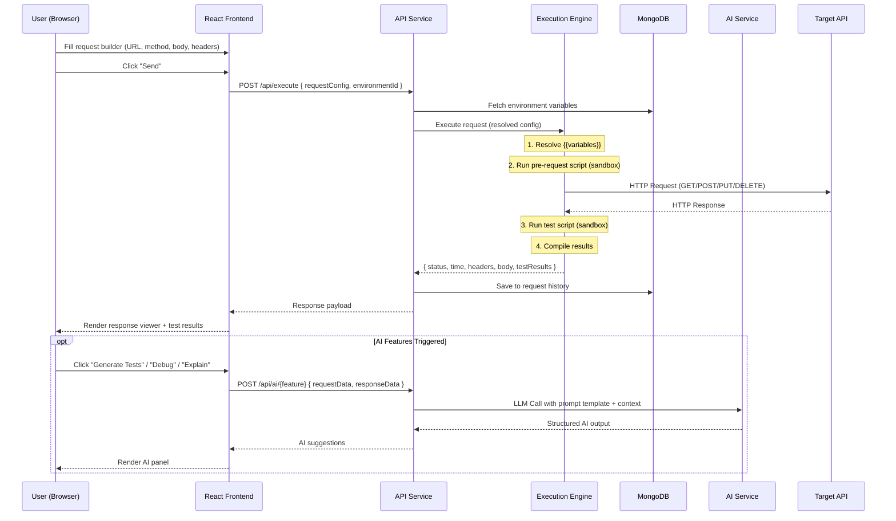

# AI-Powered API Testing Tool — Research Report

## Part 2: Architecture, Tech Stack & Implementation Requirements

**Project:** AI-Powered API Testing Web Application  
**Author:** Research for Bharat Bhangale  
**Date:** May 2026  
**Report Series:** Part 2 of 3

---

## Table of Contents

1. [System Architecture](#1-system-architecture)
2. [Backend Architecture & Implementation](#2-backend-architecture--implementation)
3. [Frontend Architecture & Implementation](#3-frontend-architecture--implementation)
4. [AI Integration Approach](#4-ai-integration-approach)
5. [Database Design](#5-database-design)
6. [Security & Scalability](#6-security--scalability)
7. [Deployment & DevOps](#7-deployment--devops)
8. [Recommended Tech Stack (Complete)](#8-recommended-tech-stack-complete)

---

## 1. System Architecture

### 1.1 High-Level Architecture Diagram

```
┌────────────────────────────────────────────────────────────────────────────┐
│                           CLIENT LAYER                                     │
│                                                                            │
│  ┌──────────────────────────────────────────────────────────────────────┐  │
│  │                    React SPA (Vite + TypeScript)                     │  │
│  │                                                                      │  │
│  │  ┌────────────┐ ┌────────────┐ ┌────────────┐ ┌──────────────────┐  │  │
│  │  │  Request    │ │  Response  │ │ Collection │ │   AI Assistant   │  │  │
│  │  │  Builder    │ │  Viewer    │ │  Explorer  │ │   Chat Panel     │  │  │
│  │  └─────┬──────┘ └─────┬──────┘ └─────┬──────┘ └────────┬─────────┘  │  │
│  │        │               │               │                │             │  │
│  │  ┌─────┴───────────────┴───────────────┴────────────────┴──────────┐  │  │
│  │  │           State Management (Zustand) + React Query              │  │  │
│  │  └─────────────────────────────┬───────────────────────────────────┘  │  │
│  └────────────────────────────────┼──────────────────────────────────────┘  │
│                                   │                                         │
│                    ┌──────────────┴──────────────┐                          │
│                    │  HTTPS (REST) + WebSocket    │                          │
│                    └──────────────┬──────────────┘                          │
└───────────────────────────────────┼─────────────────────────────────────────┘
                                    │
┌───────────────────────────────────┼─────────────────────────────────────────┐
│                           SERVER LAYER                                      │
│                                                                             │
│  ┌────────────────────────────────┴────────────────────────────────────┐    │
│  │                    API GATEWAY / REVERSE PROXY                      │    │
│  │              (Nginx / Caddy — SSL, Rate Limit, CORS)               │    │
│  └───────┬──────────────────┬────────────────────┬────────────────────┘    │
│          │                  │                    │                          │
│  ┌───────┴──────┐  ┌───────┴──────┐  ┌──────────┴─────────┐              │
│  │ API Service  │  │  Execution   │  │    AI Service       │              │
│  │ (Express)    │  │  Engine      │  │   (LLM Gateway)     │              │
│  │              │  │  (Workers)   │  │                     │              │
│  │ - Auth       │  │              │  │ - OpenAI / Gemini   │              │
│  │ - Collections│  │ - HTTP       │  │ - Prompt Templates  │              │
│  │ - Envs       │  │   Executor   │  │ - Response Parser   │              │
│  │ - History    │  │ - Script     │  │ - Token Mgmt        │              │
│  │ - Import     │  │   Sandbox    │  │ - Caching           │              │
│  │ - Users      │  │ - Test       │  │                     │              │
│  │ - Billing    │  │   Runner     │  │                     │              │
│  └───────┬──────┘  └──────┬───────┘  └──────────┬──────────┘              │
│          │                │                      │                          │
│  ┌───────┴────────────────┴──────────────────────┴──────────────────┐      │
│  │                    SHARED INFRASTRUCTURE                         │      │
│  │                                                                  │      │
│  │  ┌──────────┐  ┌──────────┐  ┌──────────┐  ┌─────────────────┐ │      │
│  │  │ MongoDB  │  │  Redis   │  │  BullMQ  │  │  Socket.io      │ │      │
│  │  │ Atlas    │  │ (Cache + │  │  (Job    │  │  (Real-time     │ │      │
│  │  │ (Data)   │  │  Session)│  │  Queue)  │  │   Updates)      │ │      │
│  │  └──────────┘  └──────────┘  └──────────┘  └─────────────────┘ │      │
│  └──────────────────────────────────────────────────────────────────┘      │
│                                                                             │
│  ┌──────────────────────────────────────────────────────────────────┐      │
│  │                    EXTERNAL SERVICES                             │      │
│  │                                                                  │      │
│  │  ┌──────────┐  ┌──────────┐  ┌──────────┐  ┌────────────────┐  │      │
│  │  │ OpenAI   │  │ Stripe   │  │ SendGrid │  │  Sentry        │  │      │
│  │  │ / Gemini │  │ (Billing)│  │ (Email)  │  │  (Monitoring)  │  │      │
│  │  └──────────┘  └──────────┘  └──────────┘  └────────────────┘  │      │
│  └──────────────────────────────────────────────────────────────────┘      │
└─────────────────────────────────────────────────────────────────────────────┘
```

### 1.2 Architecture Principles

| Principle | Implementation |
|:----------|:---------------|
| **Separation of Concerns** | API Service (CRUD), Execution Engine (running tests), AI Service (LLM calls) are logically separated modules. In Phase 1, they share one process. In Phase 3+, they become independent microservices. |
| **Stateless Backend** | JWT-based auth with Redis for transient state (rate limiting, cache). Any backend instance can serve any request. |
| **Async Execution** | Long-running operations (collection runs, AI generation, monitoring) are queued via BullMQ and processed by workers. |
| **Event-Driven Updates** | Socket.io pushes real-time updates (test progress, AI results) to the frontend without polling. |
| **Encrypt Everything** | TLS 1.2+ in transit, AES-256 at rest for credentials, HTTP-only secure cookies for tokens. |

### 1.3 API Workflow — Request Lifecycle



---

## 2. Backend Architecture & Implementation

### 2.1 Monolith-First, Microservice-Ready

> [!TIP]
> **Start as a modular monolith.** Organize your code as separate modules with clean interfaces. When a module needs independent scaling (e.g., the Execution Engine during peak CI/CD usage), extract it into a separate service. This approach is faster to build, easier to debug, and avoids premature distributed-system complexity.

**Phase 1 (MVP):** Single Express.js process with modular architecture  
**Phase 2 (Growth):** Extract Execution Engine into a separate worker process  
**Phase 3 (Scale):** Full microservices with message queue between services

### 2.2 Backend Module Architecture

```
┌─────────────────────────────────────────────────────────┐
│                    EXPRESS APPLICATION                    │
│                                                          │
│  ┌──────────────────────────────────────────────────┐   │
│  │              MIDDLEWARE STACK                      │   │
│  │  ┌────────┐ ┌──────┐ ┌──────┐ ┌───────┐ ┌─────┐│   │
│  │  │ CORS   │→│ Auth │→│ Rate │→│ Valid- │→│ Log ││   │
│  │  │ Handler│ │ JWT  │ │Limit │ │ ation │ │ ger ││   │
│  │  └────────┘ └──────┘ └──────┘ └───────┘ └─────┘│   │
│  └──────────────────────────────────────────────────┘   │
│                           │                              │
│  ┌────────────────────────┼──────────────────────────┐  │
│  │                   ROUTE LAYER                      │  │
│  │                                                    │  │
│  │  /api/auth/*        → Auth Controller              │  │
│  │  /api/collections/* → Collection Controller        │  │
│  │  /api/requests/*    → Request Controller           │  │
│  │  /api/environments/*→ Environment Controller       │  │
│  │  /api/execute       → Executor Controller          │  │
│  │  /api/runner/*      → Collection Runner Controller │  │
│  │  /api/ai/*          → AI Controller                │  │
│  │  /api/import/*      → Import Controller            │  │
│  │  /api/history/*     → History Controller           │  │
│  │  /api/monitor/*     → Monitor Controller           │  │
│  │  /api/billing/*     → Billing Controller           │  │
│  │  /api/users/*       → User Controller              │  │
│  │  /api/workspaces/*  → Workspace Controller         │  │
│  └────────────────────────┼──────────────────────────┘  │
│                           │                              │
│  ┌────────────────────────┼──────────────────────────┐  │
│  │                  SERVICE LAYER                     │  │
│  │                                                    │  │
│  │  AuthService         ExecutorService               │  │
│  │  CollectionService   TestRunnerService             │  │
│  │  RequestService      ScriptSandbox                 │  │
│  │  EnvironmentService  VariableResolver              │  │
│  │  ImportService       AIService (LLM Gateway)       │  │
│  │  HistoryService      MonitorService                │  │
│  │  BillingService      WebSocketService              │  │
│  └────────────────────────┼──────────────────────────┘  │
│                           │                              │
│  ┌────────────────────────┼──────────────────────────┐  │
│  │                   DATA LAYER                       │  │
│  │                                                    │  │
│  │  MongoDB (Mongoose ODM)    Redis (ioredis)         │  │
│  │  BullMQ (Job Queues)       Socket.io (Events)      │  │
│  └───────────────────────────────────────────────────┘  │
└─────────────────────────────────────────────────────────┘
```

### 2.3 API Route Design

```
Authentication & Users
├── POST   /api/auth/register            → Create account
├── POST   /api/auth/login               → Login (email/password)
├── POST   /api/auth/login/github        → OAuth login (GitHub)
├── POST   /api/auth/login/google        → OAuth login (Google)
├── POST   /api/auth/refresh             → Refresh access token
├── POST   /api/auth/logout              → Invalidate refresh token
├── GET    /api/auth/me                  → Get current user
├── PATCH  /api/users/profile            → Update profile
└── PATCH  /api/users/preferences        → Update preferences

Workspaces
├── POST   /api/workspaces               → Create workspace
├── GET    /api/workspaces               → List user's workspaces
├── GET    /api/workspaces/:id           → Get workspace details
├── PATCH  /api/workspaces/:id           → Update workspace
├── DELETE /api/workspaces/:id           → Delete workspace
├── POST   /api/workspaces/:id/members   → Invite member
├── PATCH  /api/workspaces/:id/members/:uid → Update member role
└── DELETE /api/workspaces/:id/members/:uid → Remove member

Collections
├── POST   /api/collections              → Create collection
├── GET    /api/collections              → List collections (in workspace)
├── GET    /api/collections/:id          → Get collection with requests
├── PATCH  /api/collections/:id          → Update collection (name, order)
├── DELETE /api/collections/:id          → Delete collection
├── POST   /api/collections/:id/folders  → Create folder
├── PATCH  /api/collections/:id/folders/:fid → Update folder
├── DELETE /api/collections/:id/folders/:fid → Delete folder
└── POST   /api/collections/:id/run      → Run all requests in collection

Requests (Saved)
├── POST   /api/requests                 → Create saved request
├── GET    /api/requests/:id             → Get request details
├── PATCH  /api/requests/:id             → Update request
├── DELETE /api/requests/:id             → Delete request
├── POST   /api/requests/:id/duplicate   → Duplicate request
└── PATCH  /api/requests/reorder         → Reorder requests in folder

Environments
├── POST   /api/environments             → Create environment
├── GET    /api/environments             → List environments (in workspace)
├── GET    /api/environments/:id         → Get environment with variables
├── PATCH  /api/environments/:id         → Update environment
├── DELETE /api/environments/:id         → Delete environment
└── PATCH  /api/environments/:id/active  → Set as active environment

Request Execution
├── POST   /api/execute                  → Execute a single request
└── POST   /api/execute/batch            → Execute multiple requests (workflow)

History
├── GET    /api/history                  → List request history (paginated)
├── GET    /api/history/:id              → Get history entry details
├── DELETE /api/history/:id              → Delete history entry
└── DELETE /api/history                  → Clear all history

AI Features
├── POST   /api/ai/nl-to-request        → Natural language → API request
├── POST   /api/ai/generate-tests       → Generate test assertions
├── POST   /api/ai/debug                → Debug failed request
├── POST   /api/ai/generate-data        → Generate test data
├── POST   /api/ai/explain              → Explain response/error
├── POST   /api/ai/generate-collection  → Generate collection from spec/docs
├── POST   /api/ai/validate-spec        → Validate & lint API spec
├── POST   /api/ai/compare-responses    → Compare response snapshots
└── POST   /api/ai/chat                 → General AI chat (contextual)

Import / Export
├── POST   /api/import/postman           → Import Postman collection
├── POST   /api/import/openapi           → Import OpenAPI/Swagger spec
├── POST   /api/import/curl              → Import cURL command
├── POST   /api/import/har               → Import HAR file
└── GET    /api/export/collection/:id    → Export collection as JSON

Monitoring
├── POST   /api/monitors                 → Create scheduled monitor
├── GET    /api/monitors                 → List monitors
├── GET    /api/monitors/:id             → Get monitor details + results
├── PATCH  /api/monitors/:id             → Update monitor
├── DELETE /api/monitors/:id             → Delete monitor
└── GET    /api/monitors/:id/results     → Get monitor run history

Billing (Stripe Integration)
├── POST   /api/billing/checkout         → Create Stripe checkout session
├── POST   /api/billing/portal           → Create Stripe customer portal
├── GET    /api/billing/subscription     → Get current subscription
└── POST   /api/billing/webhook          → Stripe webhook handler
```

### 2.4 Middleware Stack (Detailed)

```typescript
// Middleware execution order (top to bottom)
app.use(cors(corsConfig));              // 1. CORS — Allow frontend origin
app.use(helmet());                      // 2. Helmet — Security headers
app.use(express.json({ limit: '10mb' })); // 3. Body Parser — JSON payloads
app.use(express.urlencoded({ extended: true }));
app.use(requestLogger);                 // 4. Request Logger — Log all requests
app.use(rateLimiter);                   // 5. Rate Limiter — Throttle abuse

// Route-specific middleware
router.use('/api/auth', authLimiter);   // Stricter rate limit on auth routes
router.use('/api/*', authenticate);      // 6. JWT Authentication
router.use('/api/ai/*', aiRateLimiter); // 7. AI-specific rate limit per plan
router.use('/api/*', validate);          // 8. Request Validation (Zod schemas)

// After routes
app.use(notFoundHandler);               // 9. 404 handler
app.use(globalErrorHandler);            // 10. Global error handler
```

**Rate Limiting Strategy:**

| Route Group | Limit (Free) | Limit (Pro) | Limit (Team) |
|:------------|:-------------|:------------|:-------------|
| `/api/auth/*` | 10 req/min | 10 req/min | 10 req/min |
| `/api/execute` | 100 req/hour | 1000 req/hour | 5000 req/hour |
| `/api/ai/*` | 50 req/day | 500 req/day | 2000 req/day |
| `/api/*` (general) | 200 req/min | 1000 req/min | 5000 req/min |

### 2.5 Request Execution Engine (Core)

The execution engine is the heart of the application. It receives a request configuration, resolves variables, executes scripts, sends the HTTP request, and returns structured results.

```typescript
// services/executor/executor.service.ts

interface ExecutionConfig {
  method: HttpMethod;
  url: string;                          // May contain {{variables}}
  headers: KeyValuePair[];
  params: KeyValuePair[];
  body: RequestBody;
  auth: AuthConfig;
  preRequestScript?: string;
  testScript?: string;
  timeout?: number;
}

interface ExecutionResult {
  request: {
    resolvedUrl: string;
    resolvedHeaders: Record<string, string>;
    resolvedBody: any;
  };
  response: {
    status: number;
    statusText: string;
    headers: Record<string, string>;
    body: any;
    size: number;                       // bytes
    timing: {
      total: number;                    // ms
      dns?: number;
      tcp?: number;
      tls?: number;
      ttfb?: number;
      download?: number;
    };
    cookies: Cookie[];
  };
  tests: TestResult[];
  metadata: {
    executedAt: Date;
    executionTime: number;              // total engine time
    environmentUsed: string;
  };
}

class ExecutorService {
  async execute(
    config: ExecutionConfig,
    environment: EnvironmentVariables,
    globalVars: GlobalVariables
  ): Promise<ExecutionResult> {
    
    // STEP 1: Merge variable scopes (global < environment < collection vars)
    const variables = this.mergeVariableScopes(globalVars, environment);

    // STEP 2: Resolve all {{variable}} placeholders
    const resolvedUrl = this.variableResolver.resolve(config.url, variables);
    const resolvedHeaders = this.variableResolver.resolveKeyValues(
      config.headers, variables
    );
    const resolvedParams = this.variableResolver.resolveKeyValues(
      config.params, variables
    );
    const resolvedBody = this.variableResolver.resolveBody(
      config.body, variables
    );

    // STEP 3: Inject authentication
    const authHeaders = this.authResolver.resolve(config.auth, variables);
    const finalHeaders = { ...resolvedHeaders, ...authHeaders };

    // STEP 4: Execute pre-request script (sandboxed)
    if (config.preRequestScript) {
      const scriptContext = this.buildPreRequestContext(variables);
      await this.scriptSandbox.execute(
        config.preRequestScript, 
        scriptContext,
        { timeout: 5000 }  // 5 second limit
      );
      // Script may have modified variables
      this.applyScriptVariableChanges(scriptContext, variables);
    }

    // STEP 5: Send the HTTP request
    const startTime = process.hrtime.bigint();
    const httpResponse = await this.httpClient.request({
      method: config.method,
      url: resolvedUrl,
      headers: finalHeaders,
      params: resolvedParams,
      data: resolvedBody,
      timeout: config.timeout || 30000,
      validateStatus: () => true,       // Don't throw on error status codes
      // Capture timing breakdown
      onDownloadProgress: this.timingTracker,
    });
    const endTime = process.hrtime.bigint();
    const totalTime = Number(endTime - startTime) / 1_000_000; // Convert to ms

    // STEP 6: Execute test script (sandboxed)
    let testResults: TestResult[] = [];
    if (config.testScript) {
      const testContext = this.buildTestContext(httpResponse, totalTime);
      testResults = await this.scriptSandbox.executeTests(
        config.testScript,
        testContext,
        { timeout: 10000 }  // 10 second limit for tests
      );
    }

    // STEP 7: Assemble and return results
    return {
      request: {
        resolvedUrl,
        resolvedHeaders: finalHeaders,
        resolvedBody,
      },
      response: {
        status: httpResponse.status,
        statusText: httpResponse.statusText,
        headers: httpResponse.headers,
        body: httpResponse.data,
        size: this.calculateSize(httpResponse),
        timing: this.extractTiming(httpResponse),
        cookies: this.extractCookies(httpResponse),
      },
      tests: testResults,
      metadata: {
        executedAt: new Date(),
        executionTime: totalTime,
        environmentUsed: environment.name,
      },
    };
  }
}
```

### 2.6 Script Sandboxing (Security-Critical)

> [!CAUTION]
> Users write arbitrary JavaScript in pre-request and test scripts. **Without proper sandboxing, a malicious script could crash your server, access files, make unauthorized network requests, or steal data from other users.** This is the single most critical security concern in the execution engine.

**Implementation using `isolated-vm`:**

```typescript
// services/executor/script-sandbox.ts

import ivm from 'isolated-vm';

class ScriptSandbox {
  async execute(
    script: string,
    context: ScriptContext,
    options: { timeout: number }
  ): Promise<void> {
    // Create an isolated V8 virtual machine instance
    const isolate = new ivm.Isolate({ memoryLimit: 128 });  // 128MB max
    const vmContext = await isolate.createContext();

    // Inject the `atx` API object (read-only reference to context)
    const jail = vmContext.global;
    await jail.set('global', jail.derefInto());

    // Inject safe APIs only
    await this.injectAtxAPI(vmContext, context);

    // Compile and run the script with strict timeout
    try {
      const compiledScript = await isolate.compileScript(script);
      await compiledScript.run(vmContext, { timeout: options.timeout });
    } catch (error) {
      if (error.message.includes('Script execution timed out')) {
        throw new ScriptTimeoutError('Script exceeded time limit');
      }
      throw new ScriptExecutionError(error.message);
    } finally {
      isolate.dispose(); // Always clean up
    }
  }

  private async injectAtxAPI(
    vmContext: ivm.Context,
    context: ScriptContext
  ): Promise<void> {
    // SAFE APIs exposed to user scripts:
    // atx.environment.get(key)     → Read environment variable
    // atx.environment.set(key,val) → Set environment variable
    // atx.response.json()          → Parse response as JSON
    // atx.response.text()          → Get response as text
    // atx.response.status          → Response status code
    // atx.response.time            → Response time in ms
    // atx.response.headers         → Response headers
    // atx.test(name, fn)           → Define a test assertion
    // atx.expect(value)            → Create assertion chain
    // console.log(...)             → Captured log output

    // BLOCKED APIs (not injected):
    // require, import              → No module loading
    // process                      → No process access
    // fs, path, os                 → No filesystem access
    // http, https, net             → No network access
    // child_process                → No command execution
    // eval, Function               → No dynamic code generation
  }
}
```

**Why `isolated-vm` over `vm2`:**
- `vm2` has had known sandbox escape vulnerabilities and is now deprecated
- `isolated-vm` creates a truly separate V8 isolate (separate heap, separate GC)
- Memory limits can be enforced at the V8 level
- True process-level isolation if needed (via worker threads)

### 2.7 Job Queue System (BullMQ)

**Purpose:** Handle long-running operations asynchronously without blocking the main API response.

```typescript
// queues/index.ts

// Queue 1: Collection Runner
const collectionRunnerQueue = new Queue('collection-runner', {
  connection: redisConnection,
  defaultJobOptions: {
    attempts: 3,
    backoff: { type: 'exponential', delay: 1000 },
    removeOnComplete: { age: 24 * 3600 },  // Keep for 24 hours
    removeOnFail: { age: 7 * 24 * 3600 },  // Keep failures for 7 days
  },
});

// Queue 2: AI Processing
const aiProcessingQueue = new Queue('ai-processing', {
  connection: redisConnection,
  defaultJobOptions: {
    attempts: 2,
    backoff: { type: 'fixed', delay: 2000 },
    timeout: 60000,  // 60 second timeout for AI calls
  },
});

// Queue 3: Monitoring
const monitoringQueue = new Queue('monitoring', {
  connection: redisConnection,
  defaultJobOptions: {
    attempts: 3,
    backoff: { type: 'exponential', delay: 5000 },
  },
});

// Queue 4: Import Processing
const importQueue = new Queue('import-processing', {
  connection: redisConnection,
});
```

**Workflow for Collection Runner:**
1. User clicks "Run Collection" in the UI
2. API creates a job in `collection-runner` queue, returns `jobId` immediately
3. Worker picks up job, executes requests sequentially
4. After each request, worker emits progress via Socket.io: `{ completed: 5, total: 20, currentTest: "GET /users" }`
5. Frontend shows real-time progress bar
6. On completion, worker stores results in MongoDB and emits `collection-run-complete`

---

## 3. Frontend Architecture & Implementation

### 3.1 Component Architecture

```
┌─────────────────────────────────────────────────────────────┐
│                          App Shell                           │
│  ┌─────┐ ┌──────────────────────────────────────────┐ ┌──┐ │
│  │     │ │              Main Content                 │ │  │ │
│  │     │ │  ┌────────────────────────────────────┐   │ │  │ │
│  │     │ │  │         Tab Bar                    │   │ │  │ │
│  │     │ │  │  [GET /users] [POST /auth] [+]     │   │ │A │ │
│  │     │ │  └────────────────────────────────────┘   │ │I │ │
│  │ S   │ │  ┌────────────────────────────────────┐   │ │  │ │
│  │ I   │ │  │     Request Section                │   │ │P │ │
│  │ D   │ │  │  ┌──────┐ ┌─────────────────────┐ │   │ │a │ │
│  │ E   │ │  │  │Method│ │   URL Input Bar      │ │   │ │n │ │
│  │ B   │ │  │  │Select│ │  {{base_url}}/users  │ │   │ │e │ │
│  │ A   │ │  │  └──────┘ └─────────────────────┘ │   │ │l │ │
│  │ R   │ │  │  ┌──────────────────────────────┐  │   │ │  │ │
│  │     │ │  │  │ [Params][Headers][Body][Auth] │  │   │ │  │ │
│  │     │ │  │  │ [Pre-Req][Tests][Settings]    │  │   │ │  │ │
│  │ C   │ │  │  └──────────────────────────────┘  │   │ │  │ │
│  │ o   │ │  │  ┌──────────────────────────────┐  │   │ │  │ │
│  │ l   │ │  │  │   Tab Content (Key-Value     │  │   │ │  │ │
│  │ l   │ │  │  │   Editor / Monaco Editor)    │  │   │ │  │ │
│  │ e   │ │  │  └──────────────────────────────┘  │   │ │  │ │
│  │ c   │ │  └────────────────────────────────────┘   │ │  │ │
│  │ t   │ │                                           │ │  │ │
│  │ i   │ │  ═══════════ Resizable Divider ══════════ │ │  │ │
│  │ o   │ │                                           │ │  │ │
│  │ n   │ │  ┌────────────────────────────────────┐   │ │  │ │
│  │     │ │  │     Response Section               │   │ │  │ │
│  │ T   │ │  │  ┌──────┐ ┌──────┐ ┌────────────┐ │   │ │  │ │
│  │ r   │ │  │  │ 200  │ │124ms │ │   1.2 KB   │ │   │ │  │ │
│  │ e   │ │  │  │ OK   │ │      │ │            │ │   │ │  │ │
│  │ e   │ │  │  └──────┘ └──────┘ └────────────┘ │   │ │  │ │
│  │     │ │  │  ┌──────────────────────────────┐  │   │ │  │ │
│  │     │ │  │  │ [Body][Headers][Cookies]      │  │   │ │  │ │
│  │     │ │  │  │ [Tests][Timeline]             │  │   │ │  │ │
│  │     │ │  │  └──────────────────────────────┘  │   │ │  │ │
│  │     │ │  │  ┌──────────────────────────────┐  │   │ │  │ │
│  │     │ │  │  │   Response Body (JSON tree   │  │   │ │  │ │
│  │     │ │  │  │   or raw text viewer)        │  │   │ │  │ │
│  │     │ │  │  └──────────────────────────────┘  │   │ │  │ │
│  │     │ │  └────────────────────────────────────┘   │ │  │ │
│  └─────┘ └──────────────────────────────────────────┘ └──┘ │
│  ┌──────────────────────────────────────────────────────┐   │
│  │  Status Bar: [Env: Development ▾] [AI: 45/50 today]  │   │
│  └──────────────────────────────────────────────────────┘   │
└─────────────────────────────────────────────────────────────┘
```

### 3.2 State Management Architecture

**Use Zustand for lightweight, performant state management.**

```typescript
// stores/requestStore.ts — Manages active request tabs
interface RequestStore {
  tabs: RequestTab[];               // All open tabs
  activeTabId: string | null;       // Currently selected tab
  
  addTab: (request?: SavedRequest) => void;
  closeTab: (tabId: string) => void;
  setActiveTab: (tabId: string) => void;
  updateTabConfig: (tabId: string, config: Partial<RequestConfig>) => void;
  setTabResponse: (tabId: string, response: ResponseData) => void;
}

// stores/collectionStore.ts — Collection tree and CRUD
interface CollectionStore {
  collections: Collection[];
  expandedFolders: Set<string>;
  
  fetchCollections: () => Promise<void>;
  createCollection: (name: string) => Promise<void>;
  moveRequest: (requestId: string, targetFolderId: string) => Promise<void>;
  toggleFolder: (folderId: string) => void;
}

// stores/environmentStore.ts — Environment variables
interface EnvironmentStore {
  environments: Environment[];
  activeEnvironmentId: string | null;
  
  setActiveEnvironment: (id: string) => void;
  resolveVariable: (key: string) => string | undefined;
  getAllVariables: () => Record<string, string>;
}

// stores/aiStore.ts — AI assistant state
interface AIStore {
  chatMessages: AIMessage[];
  suggestions: AISuggestion[];
  isGenerating: boolean;
  dailyUsage: { used: number; limit: number };
  
  sendMessage: (message: string, context: AIContext) => Promise<void>;
  generateTests: (request: RequestConfig, response: ResponseData) => Promise<void>;
  debugRequest: (request: RequestConfig, response: ResponseData) => Promise<void>;
  acceptSuggestion: (suggestionId: string) => void;
  dismissSuggestion: (suggestionId: string) => void;
}
```

**React Query for server state:**

```typescript
// hooks/useCollections.ts
export function useCollections(workspaceId: string) {
  return useQuery({
    queryKey: ['collections', workspaceId],
    queryFn: () => api.collections.list(workspaceId),
    staleTime: 30_000,  // Cache for 30 seconds
  });
}

// hooks/useExecuteRequest.ts
export function useExecuteRequest() {
  const queryClient = useQueryClient();
  
  return useMutation({
    mutationFn: (config: ExecutionPayload) => api.executor.execute(config),
    onSuccess: (result) => {
      // Invalidate history cache so it shows the new entry
      queryClient.invalidateQueries({ queryKey: ['history'] });
    },
  });
}
```

### 3.3 Monaco Editor Integration

```typescript
// components/ScriptEditor/ScriptEditor.tsx

import { Editor, OnMount } from '@monaco-editor/react';

const ScriptEditor: React.FC<ScriptEditorProps> = ({ 
  value, 
  onChange, 
  language = 'javascript' 
}) => {
  const handleEditorMount: OnMount = (editor, monaco) => {
    // Register custom autocomplete for `atx.*` API
    monaco.languages.registerCompletionItemProvider('javascript', {
      provideCompletionItems: (model, position) => {
        const suggestions = [
          {
            label: 'atx.test',
            kind: monaco.languages.CompletionItemKind.Function,
            insertText: 'atx.test("${1:test name}", () => {\n\t${2}\n});',
            insertTextRules: monaco.languages.CompletionItemInsertTextRule
              .InsertAsSnippet,
            documentation: 'Define a test assertion',
          },
          {
            label: 'atx.expect',
            kind: monaco.languages.CompletionItemKind.Function,
            insertText: 'atx.expect(${1:value}).${2:toBe}(${3:expected});',
            insertTextRules: monaco.languages.CompletionItemInsertTextRule
              .InsertAsSnippet,
            documentation: 'Create an assertion',
          },
          {
            label: 'atx.response.json',
            kind: monaco.languages.CompletionItemKind.Method,
            insertText: 'atx.response.json()',
            documentation: 'Parse response body as JSON',
          },
          {
            label: 'atx.response.status',
            kind: monaco.languages.CompletionItemKind.Property,
            insertText: 'atx.response.status',
            documentation: 'HTTP status code of the response',
          },
          {
            label: 'atx.environment.get',
            kind: monaco.languages.CompletionItemKind.Method,
            insertText: 'atx.environment.get("${1:key}")',
            insertTextRules: monaco.languages.CompletionItemInsertTextRule
              .InsertAsSnippet,
            documentation: 'Get an environment variable value',
          },
          {
            label: 'atx.environment.set',
            kind: monaco.languages.CompletionItemKind.Method,
            insertText: 'atx.environment.set("${1:key}", ${2:value});',
            insertTextRules: monaco.languages.CompletionItemInsertTextRule
              .InsertAsSnippet,
            documentation: 'Set an environment variable',
          },
        ];
        return { suggestions };
      },
    });
  };

  return (
    <Editor
      height="300px"
      language={language}
      value={value}
      onChange={onChange}
      onMount={handleEditorMount}
      theme="vs-dark"
      options={{
        minimap: { enabled: false },
        fontSize: 13,
        lineNumbers: 'on',
        scrollBeyondLastLine: false,
        automaticLayout: true,
        tabSize: 2,
        wordWrap: 'on',
        suggestOnTriggerCharacters: true,
      }}
      loading={<div className="editor-skeleton">Loading editor...</div>}
    />
  );
};
```

### 3.4 Real-Time Updates (Socket.io Client)

```typescript
// hooks/useSocket.ts

import { io, Socket } from 'socket.io-client';
import { create } from 'zustand';

interface SocketStore {
  socket: Socket | null;
  isConnected: boolean;
  connect: (token: string) => void;
  disconnect: () => void;
}

export const useSocketStore = create<SocketStore>((set, get) => ({
  socket: null,
  isConnected: false,

  connect: (token: string) => {
    const socket = io(import.meta.env.VITE_WS_URL, {
      auth: { token },                 // JWT for WebSocket auth
      reconnection: true,
      reconnectionAttempts: 5,
      reconnectionDelay: 1000,
    });

    socket.on('connect', () => set({ isConnected: true }));
    socket.on('disconnect', () => set({ isConnected: false }));

    // Listen for real-time events
    socket.on('collection-run:progress', (data) => {
      // Update collection runner progress in UI
    });
    socket.on('collection-run:complete', (data) => {
      // Show completion notification
    });
    socket.on('ai:stream', (data) => {
      // Stream AI response tokens to chat panel
    });
    socket.on('monitor:alert', (data) => {
      // Show monitoring alert notification
    });

    set({ socket });
  },

  disconnect: () => {
    get().socket?.disconnect();
    set({ socket: null, isConnected: false });
  },
}));
```

---

## 4. AI Integration Approach

### 4.1 LLM Gateway Architecture

Build a **provider-agnostic AI service** that abstracts LLM calls behind a unified interface. This lets you switch between OpenAI, Google Gemini, and Anthropic without changing feature code.

```typescript
// services/ai/llm-gateway.ts

interface LLMProvider {
  complete(params: CompletionParams): Promise<CompletionResult>;
  stream(params: CompletionParams): AsyncIterable<string>;
}

interface CompletionParams {
  systemPrompt: string;
  userPrompt: string;
  model?: string;
  temperature?: number;
  maxTokens?: number;
  responseFormat?: 'text' | 'json';
  jsonSchema?: object;              // For structured output
}

class LLMGateway {
  private providers: Map<string, LLMProvider>;
  private defaultProvider: string;
  private cache: Redis;

  constructor() {
    this.providers = new Map([
      ['openai', new OpenAIProvider()],
      ['gemini', new GeminiProvider()],
      ['anthropic', new AnthropicProvider()],
    ]);
    this.defaultProvider = process.env.DEFAULT_AI_PROVIDER || 'openai';
  }

  async complete(params: CompletionParams): Promise<CompletionResult> {
    // 1. Check cache first
    const cacheKey = this.buildCacheKey(params);
    const cached = await this.cache.get(cacheKey);
    if (cached) return JSON.parse(cached);

    // 2. Select provider
    const provider = this.providers.get(this.defaultProvider)!;

    // 3. Execute with retry logic
    const result = await this.withRetry(
      () => provider.complete(params),
      { maxRetries: 2, backoffMs: 1000 }
    );

    // 4. Cache the result (1 hour TTL)
    await this.cache.setex(cacheKey, 3600, JSON.stringify(result));

    // 5. Track usage
    await this.trackUsage(params, result);

    return result;
  }
}
```

### 4.2 Provider Implementations

```typescript
// services/ai/providers/openai.provider.ts

class OpenAIProvider implements LLMProvider {
  private client: OpenAI;

  async complete(params: CompletionParams): Promise<CompletionResult> {
    const response = await this.client.chat.completions.create({
      model: params.model || 'gpt-4o',
      messages: [
        { role: 'system', content: params.systemPrompt },
        { role: 'user', content: params.userPrompt },
      ],
      temperature: params.temperature ?? 0.2,
      max_tokens: params.maxTokens || 4000,
      // Structured output (ensures valid JSON matching schema)
      ...(params.responseFormat === 'json' && params.jsonSchema
        ? {
            response_format: {
              type: 'json_schema',
              json_schema: {
                name: 'ai_response',
                schema: params.jsonSchema,
                strict: true,
              },
            },
          }
        : {}),
    });

    return {
      content: response.choices[0].message.content || '',
      usage: {
        promptTokens: response.usage?.prompt_tokens || 0,
        completionTokens: response.usage?.completion_tokens || 0,
        totalTokens: response.usage?.total_tokens || 0,
      },
      model: response.model,
      provider: 'openai',
    };
  }
}

// services/ai/providers/gemini.provider.ts

class GeminiProvider implements LLMProvider {
  private client: GoogleGenerativeAI;

  async complete(params: CompletionParams): Promise<CompletionResult> {
    const model = this.client.getGenerativeModel({
      model: params.model || 'gemini-2.0-flash',
      systemInstruction: params.systemPrompt,
      generationConfig: {
        temperature: params.temperature ?? 0.2,
        maxOutputTokens: params.maxTokens || 4000,
        ...(params.responseFormat === 'json'
          ? { responseMimeType: 'application/json' }
          : {}),
      },
    });

    const result = await model.generateContent(params.userPrompt);
    const response = result.response;

    return {
      content: response.text(),
      usage: {
        promptTokens: response.usageMetadata?.promptTokenCount || 0,
        completionTokens: response.usageMetadata?.candidatesTokenCount || 0,
        totalTokens: response.usageMetadata?.totalTokenCount || 0,
      },
      model: 'gemini-2.0-flash',
      provider: 'gemini',
    };
  }
}
```

### 4.3 Prompt Engineering Templates

```typescript
// services/ai/prompts/test-generator.prompt.ts

export const TEST_GENERATION_SYSTEM_PROMPT = `
You are an expert API testing engineer. Your job is to generate comprehensive 
test assertions for API responses.

Rules:
1. Generate tests in JavaScript using the atx.test() and atx.expect() API
2. Cover these categories: Happy Path, Edge Cases, Negative Tests, Performance
3. Return ONLY a JSON array of test objects
4. Each test must have: name (string), category (string), script (string)
5. Use realistic assertion values based on the actual response data
6. Include at least one response time assertion
`;

export function buildTestGenerationUserPrompt(
  request: RequestConfig,
  response: ResponseData
): string {
  return `
Generate test assertions for this API response:

REQUEST:
  Method: ${request.method}
  URL: ${request.url}

RESPONSE:
  Status: ${response.status} ${response.statusText}
  Time: ${response.timing.total}ms
  Headers: ${JSON.stringify(response.headers, null, 2)}
  Body: ${JSON.stringify(response.body, null, 2).substring(0, 3000)}

Generate a comprehensive test suite covering:
- Status code verification
- Response body structure and data types
- Required fields presence
- Value format validation (emails, dates, UUIDs, etc.)
- Array length and pagination checks (if applicable)
- Response time performance assertion
- At least 2 edge case tests
- At least 2 negative scenario tests (what to test WITHOUT auth, wrong data types)
`;
}

// JSON Schema for structured output
export const TEST_GENERATION_SCHEMA = {
  type: 'object',
  properties: {
    tests: {
      type: 'array',
      items: {
        type: 'object',
        properties: {
          name: { type: 'string' },
          category: { 
            type: 'string', 
            enum: ['happy_path', 'edge_case', 'negative', 'performance'] 
          },
          script: { type: 'string' },
        },
        required: ['name', 'category', 'script'],
      },
    },
  },
  required: ['tests'],
};
```

### 4.4 AI Cost Management Strategy

| Strategy | Implementation | Impact |
|:---------|:---------------|:-------|
| **Response Caching** | Cache AI responses in Redis with hash of (prompt + context). Same request + response = same tests generated. | 30–50% cost reduction |
| **Model Tiering** | Use `gpt-4o-mini` / `gemini-2.0-flash` for simple tasks (data gen, explain). Use `gpt-4o` / `gemini-2.5-pro` for complex tasks (debugging, test gen). | 40–60% cost reduction |
| **Prompt Optimization** | Minimize context sent to LLM. Truncate response bodies to 3000 chars. Strip unnecessary headers. | 20–30% token reduction |
| **User Rate Limits** | Free: 50 AI requests/day. Pro: 500/day. Track via Redis counter with daily TTL. | Cost ceiling per user |
| **Streaming** | Stream AI responses via Socket.io. Reduces perceived latency; user sees output immediately. | Better UX, same cost |
| **Token Dashboard** | Show users their daily AI usage (`45/50 requests used today`). | User self-management |

### 4.5 Multi-Provider Strategy

| Provider | Best For | Cost (approx.) | When to Use |
|:---------|:---------|:----------------|:------------|
| **OpenAI GPT-4o** | Complex reasoning, debugging, test generation | $2.50/1M input tokens | Primary for Pro/Team users |
| **OpenAI GPT-4o-mini** | Simple tasks, explanations, data generation | $0.15/1M input tokens | Default for Free tier |
| **Google Gemini 2.0 Flash** | Fast, cost-effective general tasks | $0.075/1M input tokens | Alternative default, batch processing |
| **Google Gemini 2.5 Pro** | Complex reasoning with large context | $1.25/1M input tokens | Complex spec analysis, large codebase |
| **Anthropic Claude 4** | Nuanced reasoning, code generation | $3.00/1M input tokens | Fallback for specific use cases |
| **Self-hosted (Ollama)** | Local development, privacy-sensitive users | Free (hardware cost) | Development environment, future enterprise feature |

---

## 5. Database Design

### 5.1 Database Strategy

**Primary database: MongoDB Atlas** — Best for flexible, document-oriented API testing data where request/response structures vary wildly.

**Caching layer: Redis** — Session management, rate limiting, AI response caching, real-time pub/sub.

> [!NOTE]
> Starting with MongoDB-only is the right call for your MERN stack expertise. A hybrid PostgreSQL + MongoDB approach can be adopted later if needed for complex relational queries (billing, team management).

### 5.2 MongoDB Collections & Schemas

#### Collection 1: `users`

```javascript
{
  _id: ObjectId,
  email: String,                    // Unique, indexed
  passwordHash: String,             // bcrypt hash (null for OAuth users)
  name: String,
  avatar: String,                   // URL to avatar image
  authProvider: String,             // "email" | "github" | "google"
  authProviderId: String,           // External OAuth ID
  preferences: {
    theme: String,                  // "dark" | "light" | "system"
    editorFontSize: Number,         // Default: 14
    editorTabSize: Number,          // Default: 2
    autoSaveHistory: Boolean,       // Default: true
    defaultEnvironmentId: ObjectId,
  },
  subscription: {
    plan: String,                   // "free" | "pro" | "team" | "enterprise"
    stripeCustomerId: String,
    stripeSubscriptionId: String,
    currentPeriodEnd: Date,
    aiRequestsUsedToday: Number,    // Reset daily via cron
    aiRequestsLimit: Number,        // Based on plan
  },
  createdAt: Date,
  updatedAt: Date,
  lastLoginAt: Date,
}

// Indexes
db.users.createIndex({ email: 1 }, { unique: true });
db.users.createIndex({ authProvider: 1, authProviderId: 1 });
```

#### Collection 2: `workspaces`

```javascript
{
  _id: ObjectId,
  name: String,
  description: String,
  type: String,                     // "personal" | "team"
  ownerId: ObjectId,               // Reference to users
  members: [{
    userId: ObjectId,
    role: String,                   // "owner" | "admin" | "editor" | "viewer"
    joinedAt: Date,
  }],
  settings: {
    defaultEnvironmentId: ObjectId,
    allowMemberInvites: Boolean,
  },
  createdAt: Date,
  updatedAt: Date,
}

// Indexes
db.workspaces.createIndex({ ownerId: 1 });
db.workspaces.createIndex({ "members.userId": 1 });
```

#### Collection 3: `collections`

```javascript
{
  _id: ObjectId,
  name: String,
  description: String,
  workspaceId: ObjectId,            // Reference to workspaces
  createdBy: ObjectId,              // Reference to users
  folders: [{
    _id: ObjectId,
    name: String,
    parentFolderId: ObjectId | null, // For nested folders
    sortOrder: Number,
  }],
  auth: {                           // Collection-level auth (inherited)
    type: String,                   // "none"|"apikey"|"bearer"|"basic"|"oauth2"
    config: Mixed,                  // Auth-specific config
  },
  variables: [{                     // Collection-level variables
    key: String,
    value: String,
    type: String,                   // "text" | "secret"
  }],
  sortOrder: Number,
  createdAt: Date,
  updatedAt: Date,
}

// Indexes
db.collections.createIndex({ workspaceId: 1 });
db.collections.createIndex({ createdBy: 1 });
```

#### Collection 4: `requests`

```javascript
{
  _id: ObjectId,
  name: String,                     // Human-readable name
  collectionId: ObjectId,           // Reference to collections
  folderId: ObjectId | null,        // Reference to folder within collection
  method: String,                   // "GET"|"POST"|"PUT"|"PATCH"|"DELETE"|"HEAD"|"OPTIONS"
  url: String,                      // May contain {{variables}}
  headers: [{
    key: String,
    value: String,
    description: String,
    enabled: Boolean,
  }],
  params: [{                        // Query parameters
    key: String,
    value: String,
    description: String,
    enabled: Boolean,
  }],
  body: {
    mode: String,                   // "none"|"json"|"form-data"|"urlencoded"|"raw"|"binary"|"graphql"
    content: Mixed,                 // Varies by mode
    contentType: String,            // e.g., "application/json"
  },
  auth: {                           // Request-level auth override
    type: String,                   // "inherit"|"none"|"apikey"|"bearer"|"basic"|"oauth2"
    config: Mixed,
  },
  preRequestScript: String,         // JavaScript code
  testScript: String,               // JavaScript code
  settings: {
    timeout: Number,                // ms, default 30000
    followRedirects: Boolean,       // default true
    maxRedirects: Number,           // default 5
  },
  sortOrder: Number,
  createdBy: ObjectId,
  createdAt: Date,
  updatedAt: Date,
}

// Indexes
db.requests.createIndex({ collectionId: 1 });
db.requests.createIndex({ folderId: 1 });
db.requests.createIndex({ collectionId: 1, sortOrder: 1 });
```

#### Collection 5: `environments`

```javascript
{
  _id: ObjectId,
  name: String,                     // "Development", "Staging", "Production"
  workspaceId: ObjectId,
  variables: [{
    key: String,
    value: String,                  // Encrypted if type is "secret"
    type: String,                   // "text" | "secret"
    description: String,
  }],
  isDefault: Boolean,               // One default per workspace
  createdBy: ObjectId,
  createdAt: Date,
  updatedAt: Date,
}

// Indexes
db.environments.createIndex({ workspaceId: 1 });
```

#### Collection 6: `history`

```javascript
{
  _id: ObjectId,
  userId: ObjectId,
  workspaceId: ObjectId,
  request: {                        // Snapshot of the request as sent
    method: String,
    url: String,                    // Resolved (no variables)
    headers: Object,
    body: Mixed,
  },
  response: {
    status: Number,
    statusText: String,
    headers: Object,
    body: Mixed,                    // Truncated if > 1MB
    size: Number,                   // bytes
    timing: {
      total: Number,
      dns: Number,
      tcp: Number,
      tls: Number,
      ttfb: Number,
      download: Number,
    },
  },
  tests: [{
    name: String,
    passed: Boolean,
    error: String | null,
  }],
  environmentName: String,
  collectionId: ObjectId | null,    // null for unsaved requests
  requestId: ObjectId | null,
  executedAt: Date,
}

// Indexes — Critical for performance
db.history.createIndex({ userId: 1, executedAt: -1 });  // User's history, newest first
db.history.createIndex({ workspaceId: 1, executedAt: -1 });
db.history.createIndex({ executedAt: 1 }, { expireAfterSeconds: 7776000 }); // TTL: 90 days
```

#### Collection 7: `monitors`

```javascript
{
  _id: ObjectId,
  name: String,
  collectionId: ObjectId,           // Which collection to run
  environmentId: ObjectId,          // Which environment to use
  workspaceId: ObjectId,
  schedule: {
    type: String,                   // "interval" | "cron"
    intervalMinutes: Number,        // e.g., 5, 60, 1440
    cronExpression: String,         // e.g., "0 */6 * * *"
    timezone: String,               // e.g., "Asia/Kolkata"
  },
  alerts: [{
    channel: String,                // "email" | "slack" | "webhook"
    config: Mixed,                  // Email address, webhook URL, etc.
    triggerOn: String,              // "any_failure" | "consecutive_failures"
    consecutiveThreshold: Number,   // e.g., 3 consecutive failures
  }],
  lastRunAt: Date,
  lastRunStatus: String,            // "pass" | "fail" | "error"
  isActive: Boolean,
  createdBy: ObjectId,
  createdAt: Date,
  updatedAt: Date,
}

// Indexes
db.monitors.createIndex({ workspaceId: 1 });
db.monitors.createIndex({ isActive: 1, "schedule.nextRunAt": 1 });
```

#### Collection 8: `responseSnapshots`

```javascript
{
  _id: ObjectId,
  requestId: ObjectId,
  label: String,                    // "baseline" | "v2.0" | custom label
  response: {
    status: Number,
    headers: Object,
    bodySchema: Object,             // Extracted JSON structure (types only)
    bodySample: Mixed,              // Truncated sample data
    timing: Number,
  },
  createdAt: Date,
  createdBy: ObjectId,
}

// Indexes
db.responseSnapshots.createIndex({ requestId: 1, createdAt: -1 });
```

### 5.3 Data Lifecycle & Retention

| Data Type | Retention | Strategy |
|:----------|:----------|:---------|
| Users, Collections, Requests, Environments | Permanent | Core user data — never auto-delete |
| Request History | 90 days (Free) / 365 days (Pro) | MongoDB TTL index on `executedAt` |
| Response Snapshots | 30 days (Free) / 180 days (Pro) | TTL index + manual management |
| AI Chat History | 30 days | TTL index |
| Monitor Results | 30 days (Free) / 90 days (Pro) | TTL index per plan |
| Audit Logs | 1 year (Enterprise) | Separate collection with TTL |

---

## 6. Security & Scalability

### 6.1 Security Implementation

#### OWASP API Top 10 Alignment

| OWASP Risk | Your Mitigation |
|:-----------|:----------------|
| **API1: Broken Object-Level Authorization** | Every database query filters by `userId` or `workspaceId`. Middleware checks resource ownership before any operation. |
| **API2: Broken Authentication** | JWT with short-lived tokens (15 min), HTTP-only refresh cookies, bcrypt password hashing (salt rounds: 12), OAuth 2.0 for third-party auth. |
| **API3: Broken Object Property-Level Authorization** | Use Zod schemas to whitelist allowed fields in requests. Strip unknown properties. Mask secret variables in API responses. |
| **API4: Unrestricted Resource Consumption** | Rate limiting at multiple levels (per-IP, per-user, per-plan). Request body size limit (10MB). Script execution timeout (5s). |
| **API5: Broken Function-Level Authorization** | RBAC middleware for workspace operations. Admin/owner-only routes for member management and billing. |
| **API6: Unrestricted Access to Sensitive Business Flows** | AI rate limiting per plan. Collection runner limited by plan. Monitor creation limited by plan. |
| **API7: Server-Side Request Forgery (SSRF)** | The execution engine is an SSRF vector by design (it sends requests to user-specified URLs). Mitigate: Block requests to internal IPs (127.0.0.1, 10.x, 172.16-31.x, 192.168.x). Block requests to cloud metadata endpoints (169.254.169.254). |
| **API8: Security Misconfiguration** | Helmet.js for security headers. CORS whitelist (only your frontend domain). No stack traces in production error responses. |
| **API9: Improper Inventory Management** | API versioning from day one (/api/v1/). Deprecation headers for old endpoints. |
| **API10: Unsafe Consumption of APIs** | Validate all AI responses before displaying to users. Sanitize imported collection data. |

#### Credential Encryption

```typescript
// utils/encryption.ts

import { createCipheriv, createDecipheriv, randomBytes } from 'crypto';

const ALGORITHM = 'aes-256-gcm';
const KEY = Buffer.from(process.env.ENCRYPTION_KEY!, 'hex'); // 32 bytes

export function encrypt(plaintext: string): EncryptedValue {
  const iv = randomBytes(16);
  const cipher = createCipheriv(ALGORITHM, KEY, iv);
  
  let encrypted = cipher.update(plaintext, 'utf8', 'hex');
  encrypted += cipher.final('hex');
  
  const authTag = cipher.getAuthTag();
  
  return {
    encrypted,
    iv: iv.toString('hex'),
    authTag: authTag.toString('hex'),
  };
}

export function decrypt(encryptedValue: EncryptedValue): string {
  const decipher = createDecipheriv(
    ALGORITHM,
    KEY,
    Buffer.from(encryptedValue.iv, 'hex')
  );
  decipher.setAuthTag(Buffer.from(encryptedValue.authTag, 'hex'));
  
  let decrypted = decipher.update(encryptedValue.encrypted, 'hex', 'utf8');
  decrypted += decipher.final('utf8');
  
  return decrypted;
}
```

### 6.2 Scalability Design

#### Horizontal Scaling Plan

| Component | Phase 1 (MVP) | Phase 2 (Growth) | Phase 3 (Scale) |
|:----------|:--------------|:------------------|:-----------------|
| **Frontend** | Vercel (Static) | Vercel (CDN) | Vercel + CloudFront |
| **API Service** | 1 instance (Railway/Render) | 2–3 instances + load balancer | Kubernetes pods (auto-scale) |
| **Execution Engine** | Same process | Separate worker(s) | Worker fleet (K8s HPA) |
| **AI Service** | Same process | Separate service | Separate service + queue |
| **MongoDB** | Atlas M10 (shared) | Atlas M30 (dedicated) | Atlas M50 + read replicas |
| **Redis** | Upstash (serverless) | Redis Cloud (dedicated) | Redis Cluster |
| **Queue** | BullMQ (single Redis) | BullMQ (dedicated Redis) | BullMQ + separate workers |

#### Caching Strategy

| Cache Layer | What | TTL | Technology |
|:------------|:-----|:----|:-----------|
| **CDN** | Static assets (JS, CSS, images) | 1 year (fingerprinted) | Vercel Edge / CloudFront |
| **API Response** | Collection lists, environment lists | 30 seconds | Redis |
| **AI Responses** | Generated tests for same request+response | 1 hour | Redis |
| **Session** | Refresh token validation | Token lifetime | Redis |
| **Rate Limit Counters** | Per-user request counts | 1 min / 1 day | Redis |

---

## 7. Deployment & DevOps

### 7.1 Docker Configuration

```dockerfile
# ---- Backend Dockerfile (Multi-stage) ----

# Stage 1: Build
FROM node:22-alpine AS builder
WORKDIR /app
COPY package*.json ./
RUN npm ci --only=production && npm cache clean --force
COPY . .
RUN npm run build

# Stage 2: Production
FROM node:22-alpine AS production
WORKDIR /app

# Security: Non-root user
RUN addgroup -g 1001 -S appuser && \
    adduser -S appuser -u 1001
USER appuser

COPY --from=builder --chown=appuser:appuser /app/dist ./dist
COPY --from=builder --chown=appuser:appuser /app/node_modules ./node_modules
COPY --from=builder --chown=appuser:appuser /app/package.json ./

ENV NODE_ENV=production
EXPOSE 8000

HEALTHCHECK --interval=30s --timeout=10s --start-period=5s --retries=3 \
  CMD node -e "fetch('http://localhost:8000/health').then(r => process.exit(r.ok ? 0 : 1))"

CMD ["node", "dist/app.js"]
```

### 7.2 CI/CD Pipeline (GitHub Actions)

```yaml
# .github/workflows/ci-cd.yml

name: CI/CD Pipeline

on:
  push:
    branches: [main, develop]
  pull_request:
    branches: [main]

jobs:
  # ---- CI: Test & Lint ----
  test:
    runs-on: ubuntu-latest
    services:
      mongodb:
        image: mongo:7
        ports: ['27017:27017']
      redis:
        image: redis:7-alpine
        ports: ['6379:6379']
    steps:
      - uses: actions/checkout@v4
      - uses: actions/setup-node@v4
        with:
          node-version: 22
          cache: 'npm'
      - run: npm ci
      - run: npm run lint
      - run: npm run type-check
      - run: npm run test -- --coverage
      - run: npm run test:e2e

  # ---- Security Scan ----
  security:
    runs-on: ubuntu-latest
    steps:
      - uses: actions/checkout@v4
      - run: npm audit --audit-level=high
      - uses: snyk/actions/node@master
        env:
          SNYK_TOKEN: ${{ secrets.SNYK_TOKEN }}

  # ---- CD: Deploy to Staging ----
  deploy-staging:
    needs: [test, security]
    if: github.ref == 'refs/heads/develop'
    runs-on: ubuntu-latest
    steps:
      - uses: actions/checkout@v4
      - name: Deploy Backend to Railway (Staging)
        run: railway up --service backend --environment staging
        env:
          RAILWAY_TOKEN: ${{ secrets.RAILWAY_TOKEN }}
      - name: Deploy Frontend to Vercel (Preview)
        run: vercel deploy --token ${{ secrets.VERCEL_TOKEN }}

  # ---- CD: Deploy to Production ----
  deploy-production:
    needs: [test, security]
    if: github.ref == 'refs/heads/main'
    runs-on: ubuntu-latest
    environment: production
    steps:
      - uses: actions/checkout@v4
      - name: Deploy Backend to Railway (Production)
        run: railway up --service backend --environment production
        env:
          RAILWAY_TOKEN: ${{ secrets.RAILWAY_TOKEN }}
      - name: Deploy Frontend to Vercel (Production)
        run: vercel deploy --prod --token ${{ secrets.VERCEL_TOKEN }}
```

### 7.3 Monitoring & Observability Stack

```
┌─────────────────────────────────────────────────────────────┐
│                    OBSERVABILITY STACK                        │
│                                                              │
│  ┌──────────────┐  ┌──────────────┐  ┌───────────────────┐ │
│  │   Sentry     │  │  Uptime Kuma │  │    Grafana Cloud  │ │
│  │              │  │  (or Better  │  │                   │ │
│  │  - Error     │  │   Uptime)    │  │  - Dashboards     │ │
│  │    Tracking  │  │              │  │  - Metrics        │ │
│  │  - Perf      │  │  - Uptime    │  │  - Logs (Loki)    │ │
│  │    Monitoring│  │    Monitoring│  │  - Traces (Tempo) │ │
│  │  - Release   │  │  - Status    │  │                   │ │
│  │    Tracking  │  │    Page      │  │                   │ │
│  └──────┬───────┘  └──────┬───────┘  └────────┬──────────┘ │
│         │                 │                    │             │
│         └─────────────────┴────────────────────┘             │
│                           │                                  │
│                    OpenTelemetry SDK                          │
│                    (Instrument once, send everywhere)         │
└─────────────────────────────────────────────────────────────┘
```

| Tool | Purpose | Cost |
|:-----|:--------|:-----|
| **Sentry** | Error tracking, performance monitoring, release tracking | Free (5K events/mo) |
| **Uptime Kuma** | Self-hosted uptime monitoring + status page | Free (self-hosted) |
| **Grafana Cloud** | Metrics dashboards, log aggregation, traces | Free (basic tier) |
| **OpenTelemetry** | Vendor-neutral instrumentation | Free (open-source) |
| **LogRocket** (optional) | Frontend session replay for debugging user issues | Free (1K sessions/mo) |

---

## 8. Recommended Tech Stack (Complete)

### 8.1 Full Technology Stack Table

| Category | Technology | Purpose | Why This Choice |
|:---------|:-----------|:--------|:----------------|
| **Frontend Framework** | React 19 + TypeScript | UI framework | Largest ecosystem, your expertise, TypeScript for safety |
| **Build Tool** | Vite 6 | Frontend bundler | 10x faster than Webpack, excellent DX |
| **State Management** | Zustand | Client state | Simple, performant, minimal boilerplate vs Redux |
| **Server State** | TanStack Query (React Query) v5 | API data fetching/caching | Industry standard for server state management |
| **UI Components** | Radix UI + custom CSS | Accessible primitives | Unstyled, accessible, maximum design control |
| **Styling** | CSS Modules + CSS Variables | Styling system | No runtime overhead, full control, no vendor lock-in |
| **Code Editor** | @monaco-editor/react | Script/JSON editing | Same engine as VS Code, best DX |
| **JSON Viewer** | react-json-view-lite | Response body rendering | Collapsible, searchable, performant for large JSON |
| **Icons** | Lucide React | Icon system | 1000+ icons, tree-shakeable, consistent design |
| **Notifications** | Sonner | Toast notifications | Beautiful, minimal API, supports promises |
| **Routing** | React Router v7 | Page navigation | Industry standard, supports nested routes |
| | | | |
| **Backend Framework** | Express.js 5 + TypeScript | API server | Mature, extensive middleware, your expertise |
| **Runtime** | Node.js 22 LTS | Server runtime | Latest LTS, native fetch, performance improvements |
| **Validation** | Zod | Schema validation | Type-safe, composable, works on both client + server |
| **HTTP Client** | undici | Request execution | Built into Node.js, faster than Axios for server use |
| **Script Sandbox** | isolated-vm | User script execution | True V8 isolation, memory limits, secure |
| **Job Queue** | BullMQ | Background processing | Redis-based, reliable, supports scheduling |
| **WebSocket** | Socket.io | Real-time communication | Reliable, room-based, auto-reconnection |
| **Auth Library** | Passport.js + jsonwebtoken | Authentication | Flexible OAuth strategies, JWT handling |
| **Email** | Resend (or SendGrid) | Transactional email | Modern API, React email templates |
| | | | |
| **Primary Database** | MongoDB Atlas | Data persistence | Flexible schemas for API data, your expertise |
| **ODM** | Mongoose 8 | MongoDB interface | Schema validation, middleware hooks, TypeScript support |
| **Cache / Session** | Redis (Upstash or Redis Cloud) | Caching, rate limiting | Serverless-friendly, global distribution |
| | | | |
| **AI Provider (Primary)** | OpenAI API (GPT-4o, GPT-4o-mini) | AI features | Best for code/test generation, structured outputs |
| **AI Provider (Secondary)** | Google Gemini API (2.0 Flash) | Cost optimization | Cheapest per-token, fast, good for simple tasks |
| **AI SDK** | Vercel AI SDK | Streaming, multi-provider | Unified API for OpenAI/Gemini/Anthropic + streaming |
| **AI Orchestration** | LangChain.js (optional) | Complex AI chains | Prompt chaining, memory, RAG (for learning mode) |
| | | | |
| **Authentication** | JWT + Passport.js + OAuth | User auth | Standard approach, supports email + social login |
| **Payments** | Stripe | Billing & subscriptions | Industry standard, webhooks, customer portal |
| **File Storage** | Cloudinary or AWS S3 | User uploads (avatars, files) | CDN-backed, image optimization |
| | | | |
| **Testing (Unit)** | Vitest | Unit + integration tests | Fast, Vite-native, Jest-compatible API |
| **Testing (E2E)** | Playwright | End-to-end browser tests | Multi-browser, reliable, fast |
| **Testing (API)** | Supertest | API endpoint testing | Express-integrated, assertion support |
| **Linting** | ESLint 9 + Prettier | Code quality | Flat config, TypeScript support |
| | | | |
| **CI/CD** | GitHub Actions | Automation pipeline | Free for public repos, deep GitHub integration |
| **Frontend Hosting** | Vercel | Static + Edge deployment | Automatic deploys, CDN, preview URLs |
| **Backend Hosting** | Railway (MVP) → AWS/GCP (Scale) | Server deployment | Simple deploys, database add-ons, affordable |
| **Containerization** | Docker | Environment consistency | Standard, portable, reproducible builds |
| **Container Registry** | GitHub Container Registry | Docker image storage | Free, integrated with GitHub Actions |
| | | | |
| **Error Tracking** | Sentry | Error monitoring | Real-time alerts, stack traces, release tracking |
| **Uptime Monitoring** | Uptime Kuma (self-hosted) | Status monitoring | Free, beautiful status page, self-hosted |
| **Metrics/Logs** | Grafana Cloud | Observability dashboards | Free tier, unified metrics + logs + traces |
| **Instrumentation** | OpenTelemetry | Telemetry collection | Vendor-neutral, instrument once |
| | | | |
| **Secrets Management** | dotenv + Railway/Vercel secrets | Secret storage | Environment-based, no code changes |
| **Dependency Scanning** | Snyk | Vulnerability detection | Automated PRs for fixes, CI integration |
| **API Documentation** | Scalar (for your own API) | Internal API docs | Beautiful, modern, interactive |

---

*End of Part 2. Continue to Part 3 for Folder Structure and Documentation Plan.*
