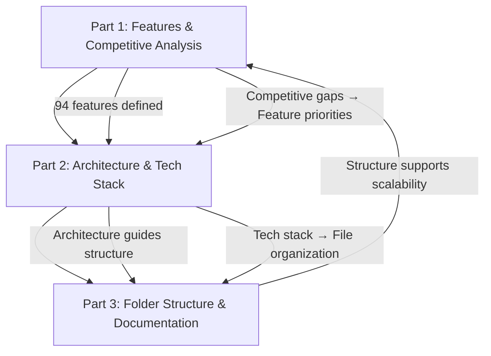

# AI-Powered API Testing Tool — Research Report

## Part 3: Folder Structure & Documentation Plan

**Project:** AI-Powered API Testing Web Application  
**Author:** Research for Bharat Bhangale  
**Date:** May 2026  
**Report Series:** Part 3 of 3

---

## Table of Contents

1. [Project Root Structure](#1-project-root-structure)
2. [Frontend Folder Structure](#2-frontend-folder-structure)
3. [Backend Folder Structure](#3-backend-folder-structure)
4. [AI Services Folder Structure](#4-ai-services-folder-structure)
5. [Testing Module Structure](#5-testing-module-structure)
6. [Documentation Plan](#6-documentation-plan)
7. [Infrastructure & DevOps Structure](#7-infrastructure--devops-structure)
8. [Cross-Report Summary](#8-cross-report-summary)

---

## 1. Project Root Structure

```
api-testing-tool/                         # Root monorepo
├── apps/
│   ├── web/                              # React frontend application
│   └── api/                              # Express backend application
├── packages/
│   ├── shared/                           # Shared types, utils, constants
│   │   ├── src/
│   │   │   ├── types/                    # TypeScript interfaces shared across apps
│   │   │   ├── constants/                # Shared constants (HTTP methods, status codes)
│   │   │   ├── utils/                    # Shared utility functions
│   │   │   └── index.ts
│   │   ├── package.json
│   │   └── tsconfig.json
│   ├── ui/                               # (Optional) Shared UI component library
│   │   ├── src/
│   │   │   ├── components/
│   │   │   └── styles/
│   │   └── package.json
│   └── eslint-config/                    # Shared ESLint configuration
│       ├── base.js
│       ├── react.js
│       └── node.js
├── docs/                                 # Project documentation
│   ├── architecture/                     # Architecture Decision Records (ADRs)
│   ├── api/                              # API documentation
│   ├── guides/                           # Developer guides
│   └── user-guide/                       # End-user documentation
├── infra/                                # Infrastructure & DevOps
│   ├── docker/
│   ├── k8s/
│   ├── terraform/
│   └── scripts/
├── .github/
│   ├── workflows/                        # CI/CD pipeline definitions
│   │   ├── ci.yml
│   │   ├── deploy-staging.yml
│   │   └── deploy-production.yml
│   ├── PULL_REQUEST_TEMPLATE.md
│   └── ISSUE_TEMPLATE/
├── .gitignore
├── .env.example                          # Example environment variables
├── package.json                          # Root package.json (workspace)
├── pnpm-workspace.yaml                   # (or npm workspaces config)
├── turbo.json                            # Turborepo config (for monorepo)
├── tsconfig.base.json                    # Base TypeScript config
├── LICENSE
├── README.md
├── CONTRIBUTING.md
└── CHANGELOG.md
```

> [!TIP]
> **Why a monorepo?** Using a monorepo (with pnpm workspaces or Turborepo) keeps frontend, backend, and shared code in one repository. This enables:
> - Shared TypeScript types between frontend and backend (no duplication)
> - Single CI/CD pipeline
> - Atomic commits across frontend + backend changes
> - Simpler dependency management
>
> **For MVP:** You can start with a simpler structure (separate `client/` and `server/` folders without workspace tooling) and migrate to a full monorepo later.

---

## 2. Frontend Folder Structure

```
apps/web/
├── public/
│   ├── favicon.ico
│   ├── logo.svg
│   └── manifest.json
├── src/
│   ├── app/                              # Application entry & routing
│   │   ├── App.tsx                       # Root component
│   │   ├── routes.tsx                    # Route definitions
│   │   ├── providers.tsx                 # Context providers wrapper
│   │   └── error-boundary.tsx            # Global error boundary
│   │
│   ├── assets/                           # Static assets
│   │   ├── images/
│   │   ├── fonts/
│   │   └── icons/
│   │
│   ├── components/                       # Reusable UI components
│   │   ├── common/                       # Generic, app-wide components
│   │   │   ├── Button/
│   │   │   │   ├── Button.tsx
│   │   │   │   ├── Button.module.css
│   │   │   │   └── index.ts
│   │   │   ├── Input/
│   │   │   ├── Modal/
│   │   │   ├── Dropdown/
│   │   │   ├── Tabs/
│   │   │   ├── Badge/
│   │   │   ├── Tooltip/
│   │   │   ├── Spinner/
│   │   │   ├── EmptyState/
│   │   │   ├── KeyValueEditor/           # Reusable key-value pair editor
│   │   │   │   ├── KeyValueEditor.tsx
│   │   │   │   ├── KeyValueRow.tsx
│   │   │   │   └── KeyValueEditor.module.css
│   │   │   └── SyntaxHighlighter/
│   │   │
│   │   ├── layout/                       # Layout components
│   │   │   ├── AppShell/                 # Main app layout (sidebar + content)
│   │   │   │   ├── AppShell.tsx
│   │   │   │   └── AppShell.module.css
│   │   │   ├── Sidebar/
│   │   │   │   ├── Sidebar.tsx
│   │   │   │   └── Sidebar.module.css
│   │   │   ├── TopBar/
│   │   │   ├── StatusBar/
│   │   │   └── ResizablePanel/           # Draggable divider between panels
│   │   │
│   │   ├── request-builder/              # Request construction components
│   │   │   ├── RequestBuilder.tsx        # Main composite component
│   │   │   ├── MethodSelector.tsx        # HTTP method dropdown (GET, POST, etc.)
│   │   │   ├── UrlInput.tsx              # URL bar with variable highlighting
│   │   │   ├── SendButton.tsx            # Send request button with loading state
│   │   │   ├── ParamsEditor.tsx          # Query parameters tab
│   │   │   ├── HeadersEditor.tsx         # Request headers tab
│   │   │   ├── BodyEditor.tsx            # Request body tab
│   │   │   │   ├── BodyEditor.tsx        # Tab container (JSON, Form, Raw, etc.)
│   │   │   │   ├── JsonBodyEditor.tsx    # Monaco editor for JSON
│   │   │   │   ├── FormDataEditor.tsx    # Form-data key-value + file upload
│   │   │   │   ├── UrlencodedEditor.tsx  # URL-encoded key-value
│   │   │   │   ├── RawBodyEditor.tsx     # Plain text editor
│   │   │   │   └── GraphQLEditor.tsx     # GraphQL query editor
│   │   │   ├── AuthConfig.tsx            # Authentication configuration panel
│   │   │   │   ├── AuthConfig.tsx        # Auth type selector
│   │   │   │   ├── ApiKeyAuth.tsx
│   │   │   │   ├── BearerAuth.tsx
│   │   │   │   ├── BasicAuth.tsx
│   │   │   │   └── OAuth2Auth.tsx
│   │   │   ├── SettingsPanel.tsx         # Request-level settings (timeout, redirects)
│   │   │   └── request-builder.module.css
│   │   │
│   │   ├── response-viewer/              # Response display components
│   │   │   ├── ResponseViewer.tsx        # Main composite component
│   │   │   ├── ResponseMeta.tsx          # Status badge, time, size
│   │   │   ├── ResponseBody.tsx          # JSON tree / raw text viewer
│   │   │   ├── ResponseHeaders.tsx       # Headers table
│   │   │   ├── ResponseCookies.tsx       # Cookies table
│   │   │   ├── TestResults.tsx           # Pass/fail assertion list
│   │   │   ├── TimingBreakdown.tsx       # Waterfall timing visualization
│   │   │   ├── ResponseActions.tsx       # Copy, Save, Compare buttons
│   │   │   └── response-viewer.module.css
│   │   │
│   │   ├── collections/                  # Collection management components
│   │   │   ├── CollectionTree.tsx        # Sidebar tree view
│   │   │   ├── CollectionItem.tsx        # Collection node with context menu
│   │   │   ├── FolderItem.tsx            # Folder node
│   │   │   ├── RequestItem.tsx           # Request node (with method badge)
│   │   │   ├── CreateCollectionModal.tsx
│   │   │   ├── ImportModal.tsx           # Import from Postman/OpenAPI/cURL
│   │   │   └── collections.module.css
│   │   │
│   │   ├── environments/                 # Environment management
│   │   │   ├── EnvSelector.tsx           # Active environment dropdown
│   │   │   ├── EnvManager.tsx            # Environment CRUD modal
│   │   │   ├── VariableEditor.tsx        # Variable key-value editor
│   │   │   ├── SecretMask.tsx            # Masked display for secret variables
│   │   │   └── environments.module.css
│   │   │
│   │   ├── script-editor/               # Test & pre-request script editor
│   │   │   ├── ScriptEditor.tsx          # Monaco editor with atx.* autocomplete
│   │   │   ├── ScriptTabs.tsx            # Pre-request / Test tabs
│   │   │   ├── SnippetInserter.tsx       # Quick-insert common script snippets
│   │   │   └── script-editor.module.css
│   │   │
│   │   ├── ai/                           # AI feature components
│   │   │   ├── AIChatPanel.tsx           # Main AI chat sidebar
│   │   │   ├── AIChatMessage.tsx         # Individual chat bubble
│   │   │   ├── AIChatInput.tsx           # Chat input with send button
│   │   │   ├── AITestSuggestions.tsx     # Generated test suggestions list
│   │   │   ├── AITestSuggestionCard.tsx  # Individual test suggestion
│   │   │   ├── AIDebugPanel.tsx          # Debug analysis display
│   │   │   ├── AIDataGenerator.tsx       # Test data generation UI
│   │   │   ├── NLRequestBar.tsx          # Natural language input overlay
│   │   │   ├── AILearningMode.tsx        # Learning tooltips & challenges
│   │   │   ├── AIUsageIndicator.tsx      # "45/50 AI requests used" badge
│   │   │   └── ai.module.css
│   │   │
│   │   ├── runner/                       # Collection runner UI
│   │   │   ├── CollectionRunner.tsx      # Runner configuration & execution
│   │   │   ├── RunnerProgress.tsx        # Real-time progress bar
│   │   │   ├── RunnerResults.tsx         # Summary dashboard
│   │   │   └── runner.module.css
│   │   │
│   │   ├── history/                      # Request history
│   │   │   ├── HistoryList.tsx
│   │   │   ├── HistoryItem.tsx
│   │   │   ├── HistorySearch.tsx
│   │   │   └── history.module.css
│   │   │
│   │   ├── settings/                     # User & app settings
│   │   │   ├── SettingsPage.tsx
│   │   │   ├── ProfileSettings.tsx
│   │   │   ├── EditorSettings.tsx
│   │   │   ├── ThemeSettings.tsx
│   │   │   ├── BillingSettings.tsx
│   │   │   └── settings.module.css
│   │   │
│   │   └── auth/                         # Authentication pages
│   │       ├── LoginPage.tsx
│   │       ├── RegisterPage.tsx
│   │       ├── ForgotPasswordPage.tsx
│   │       ├── OAuthCallback.tsx
│   │       └── auth.module.css
│   │
│   ├── hooks/                            # Custom React hooks
│   │   ├── useAuth.ts                    # Authentication state & actions
│   │   ├── useExecuteRequest.ts          # Request execution mutation
│   │   ├── useCollections.ts             # Collection CRUD queries
│   │   ├── useEnvironments.ts            # Environment management
│   │   ├── useHistory.ts                 # Request history queries
│   │   ├── useAI.ts                      # AI feature hooks
│   │   ├── useSocket.ts                  # WebSocket connection management
│   │   ├── useTheme.ts                   # Theme switching (dark/light)
│   │   ├── useKeyboardShortcuts.ts       # Global keyboard shortcut handler
│   │   ├── useDebounce.ts                # Input debouncing
│   │   └── useLocalStorage.ts            # Persistent local storage
│   │
│   ├── stores/                           # Zustand state stores
│   │   ├── requestStore.ts               # Active tabs, current request state
│   │   ├── collectionStore.ts            # Collection tree state
│   │   ├── environmentStore.ts           # Environment & variable state
│   │   ├── aiStore.ts                    # AI chat messages & suggestions
│   │   ├── uiStore.ts                    # UI state (sidebar open, panels, modals)
│   │   └── authStore.ts                  # User authentication state
│   │
│   ├── services/                         # API service layer (HTTP client)
│   │   ├── api.ts                        # Axios/fetch instance with interceptors
│   │   ├── auth.service.ts               # Auth API calls
│   │   ├── collection.service.ts         # Collection CRUD API calls
│   │   ├── request.service.ts            # Request CRUD API calls
│   │   ├── environment.service.ts        # Environment API calls
│   │   ├── executor.service.ts           # Request execution API calls
│   │   ├── ai.service.ts                 # AI feature API calls
│   │   ├── history.service.ts            # History API calls
│   │   ├── import.service.ts             # Import API calls
│   │   └── billing.service.ts            # Billing API calls
│   │
│   ├── utils/                            # Utility functions
│   │   ├── formatters.ts                 # Response formatting, size display
│   │   ├── validators.ts                 # Input validation helpers
│   │   ├── variable-highlighter.ts       # {{variable}} syntax highlighting
│   │   ├── curl-parser.ts               # Parse cURL commands to request config
│   │   ├── code-generators.ts            # Generate code snippets from requests
│   │   ├── http-status.ts               # Status code descriptions & colors
│   │   └── keyboard-shortcuts.ts         # Shortcut definitions
│   │
│   ├── styles/                           # Global styles
│   │   ├── index.css                     # CSS reset, variables, global styles
│   │   ├── variables.css                 # CSS custom properties (colors, spacing)
│   │   ├── themes/
│   │   │   ├── light.css                 # Light theme variables
│   │   │   └── dark.css                  # Dark theme variables
│   │   ├── typography.css                # Font imports, text styles
│   │   └── animations.css                # Reusable CSS animations
│   │
│   ├── types/                            # Frontend-specific TypeScript types
│   │   ├── request.types.ts
│   │   ├── response.types.ts
│   │   ├── collection.types.ts
│   │   ├── environment.types.ts
│   │   ├── ai.types.ts
│   │   └── ui.types.ts
│   │
│   └── main.tsx                          # Application entry point
│
├── index.html
├── vite.config.ts
├── tsconfig.json
├── tsconfig.node.json
├── vitest.config.ts                      # Unit test configuration
├── playwright.config.ts                  # E2E test configuration
├── .env.example
└── package.json
```

### Frontend Component Naming Conventions

| Convention | Example | Rule |
|:-----------|:--------|:-----|
| **Components** | `RequestBuilder.tsx` | PascalCase, descriptive name |
| **Hooks** | `useExecuteRequest.ts` | camelCase with `use` prefix |
| **Stores** | `requestStore.ts` | camelCase with `Store` suffix |
| **Services** | `collection.service.ts` | kebab-case with `.service` suffix |
| **Styles** | `Button.module.css` | PascalCase matching component, `.module.css` |
| **Types** | `request.types.ts` | kebab-case with `.types` suffix |
| **Utils** | `formatters.ts` | camelCase, descriptive of function group |
| **Constants** | `HTTP_METHODS` | UPPER_SNAKE_CASE for exported constants |

---

## 3. Backend Folder Structure

```
apps/api/
├── src/
│   ├── app.ts                            # Express app initialization
│   ├── server.ts                         # HTTP server + Socket.io setup
│   │
│   ├── config/                           # Configuration management
│   │   ├── index.ts                      # Exports merged config
│   │   ├── database.ts                   # MongoDB connection config
│   │   ├── redis.ts                      # Redis connection config
│   │   ├── cors.ts                       # CORS configuration
│   │   ├── ai.ts                         # AI provider configuration
│   │   └── env.ts                        # Environment variable validation (Zod)
│   │
│   ├── modules/                          # Feature modules (domain-driven)
│   │   ├── auth/                         # Authentication module
│   │   │   ├── auth.controller.ts        # Route handlers
│   │   │   ├── auth.service.ts           # Business logic
│   │   │   ├── auth.routes.ts            # Route definitions
│   │   │   ├── auth.validation.ts        # Zod schemas for request validation
│   │   │   ├── auth.types.ts             # Module-specific types
│   │   │   ├── strategies/               # Passport strategies
│   │   │   │   ├── jwt.strategy.ts
│   │   │   │   ├── github.strategy.ts
│   │   │   │   └── google.strategy.ts
│   │   │   └── __tests__/
│   │   │       ├── auth.controller.test.ts
│   │   │       └── auth.service.test.ts
│   │   │
│   │   ├── users/                        # User management module
│   │   │   ├── user.controller.ts
│   │   │   ├── user.service.ts
│   │   │   ├── user.routes.ts
│   │   │   ├── user.validation.ts
│   │   │   └── __tests__/
│   │   │
│   │   ├── workspaces/                   # Workspace management module
│   │   │   ├── workspace.controller.ts
│   │   │   ├── workspace.service.ts
│   │   │   ├── workspace.routes.ts
│   │   │   ├── workspace.validation.ts
│   │   │   └── __tests__/
│   │   │
│   │   ├── collections/                  # Collection CRUD module
│   │   │   ├── collection.controller.ts
│   │   │   ├── collection.service.ts
│   │   │   ├── collection.routes.ts
│   │   │   ├── collection.validation.ts
│   │   │   └── __tests__/
│   │   │
│   │   ├── requests/                     # Saved request CRUD module
│   │   │   ├── request.controller.ts
│   │   │   ├── request.service.ts
│   │   │   ├── request.routes.ts
│   │   │   ├── request.validation.ts
│   │   │   └── __tests__/
│   │   │
│   │   ├── environments/                 # Environment variables module
│   │   │   ├── environment.controller.ts
│   │   │   ├── environment.service.ts
│   │   │   ├── environment.routes.ts
│   │   │   ├── environment.validation.ts
│   │   │   └── __tests__/
│   │   │
│   │   ├── executor/                     # Request execution engine
│   │   │   ├── executor.controller.ts
│   │   │   ├── executor.service.ts       # Core execution logic
│   │   │   ├── executor.routes.ts
│   │   │   ├── executor.validation.ts
│   │   │   ├── variable-resolver.ts      # {{variable}} resolution
│   │   │   ├── auth-resolver.ts          # Authentication injection
│   │   │   ├── script-sandbox.ts         # isolated-vm sandbox
│   │   │   ├── timing-tracker.ts         # Request timing breakdown
│   │   │   ├── atx-api.ts               # Scripting API (atx.test, atx.expect)
│   │   │   └── __tests__/
│   │   │       ├── executor.service.test.ts
│   │   │       ├── variable-resolver.test.ts
│   │   │       └── script-sandbox.test.ts
│   │   │
│   │   ├── runner/                       # Collection runner module
│   │   │   ├── runner.controller.ts
│   │   │   ├── runner.service.ts
│   │   │   ├── runner.routes.ts
│   │   │   ├── runner.worker.ts          # BullMQ worker for collection runs
│   │   │   └── __tests__/
│   │   │
│   │   ├── history/                      # Request history module
│   │   │   ├── history.controller.ts
│   │   │   ├── history.service.ts
│   │   │   ├── history.routes.ts
│   │   │   └── __tests__/
│   │   │
│   │   ├── ai/                           # AI features module
│   │   │   ├── ai.controller.ts          # AI route handlers
│   │   │   ├── ai.routes.ts
│   │   │   ├── ai.validation.ts
│   │   │   ├── llm-gateway.ts            # Multi-provider LLM abstraction
│   │   │   ├── providers/                # LLM provider implementations
│   │   │   │   ├── openai.provider.ts
│   │   │   │   ├── gemini.provider.ts
│   │   │   │   └── anthropic.provider.ts
│   │   │   ├── features/                 # Individual AI feature services
│   │   │   │   ├── nl-to-request.service.ts
│   │   │   │   ├── test-generator.service.ts
│   │   │   │   ├── debug-assistant.service.ts
│   │   │   │   ├── data-generator.service.ts
│   │   │   │   ├── spec-analyzer.service.ts
│   │   │   │   ├── response-explainer.service.ts
│   │   │   │   ├── collection-generator.service.ts
│   │   │   │   ├── regression-detector.service.ts
│   │   │   │   └── chat.service.ts
│   │   │   ├── prompts/                  # Prompt engineering templates
│   │   │   │   ├── test-generation.prompt.ts
│   │   │   │   ├── debug-analysis.prompt.ts
│   │   │   │   ├── nl-to-request.prompt.ts
│   │   │   │   ├── data-generation.prompt.ts
│   │   │   │   ├── spec-analysis.prompt.ts
│   │   │   │   ├── response-explanation.prompt.ts
│   │   │   │   └── chat-system.prompt.ts
│   │   │   ├── schemas/                  # Structured output JSON schemas
│   │   │   │   ├── test-generation.schema.ts
│   │   │   │   ├── request-output.schema.ts
│   │   │   │   ├── debug-output.schema.ts
│   │   │   │   └── data-output.schema.ts
│   │   │   └── __tests__/
│   │   │       ├── test-generator.test.ts
│   │   │       └── nl-to-request.test.ts
│   │   │
│   │   ├── import/                       # Import/export module
│   │   │   ├── import.controller.ts
│   │   │   ├── import.routes.ts
│   │   │   ├── parsers/                  # Format-specific parsers
│   │   │   │   ├── postman.parser.ts     # Postman Collection v2.1 parser
│   │   │   │   ├── openapi.parser.ts     # OpenAPI/Swagger parser
│   │   │   │   ├── curl.parser.ts        # cURL command parser
│   │   │   │   └── har.parser.ts         # HAR file parser
│   │   │   └── __tests__/
│   │   │       ├── postman.parser.test.ts
│   │   │       └── openapi.parser.test.ts
│   │   │
│   │   ├── monitor/                      # API monitoring module
│   │   │   ├── monitor.controller.ts
│   │   │   ├── monitor.service.ts
│   │   │   ├── monitor.routes.ts
│   │   │   ├── monitor.scheduler.ts      # Cron-based scheduler
│   │   │   ├── monitor.worker.ts         # BullMQ worker for scheduled runs
│   │   │   ├── alerter.ts                # Send alerts (email, Slack, webhook)
│   │   │   └── __tests__/
│   │   │
│   │   └── billing/                      # Stripe billing module
│   │       ├── billing.controller.ts
│   │       ├── billing.service.ts
│   │       ├── billing.routes.ts
│   │       ├── stripe-webhook.handler.ts # Stripe webhook event processing
│   │       └── __tests__/
│   │
│   ├── models/                           # Mongoose models (database schemas)
│   │   ├── User.model.ts
│   │   ├── Workspace.model.ts
│   │   ├── Collection.model.ts
│   │   ├── Request.model.ts
│   │   ├── Environment.model.ts
│   │   ├── History.model.ts
│   │   ├── Monitor.model.ts
│   │   ├── ResponseSnapshot.model.ts
│   │   └── index.ts                      # Export all models
│   │
│   ├── middleware/                        # Express middleware
│   │   ├── authenticate.ts               # JWT verification middleware
│   │   ├── authorize.ts                  # RBAC authorization middleware
│   │   ├── rate-limiter.ts               # Rate limiting (per-user, per-route)
│   │   ├── validate.ts                   # Zod-based request validation
│   │   ├── error-handler.ts              # Global error handler
│   │   ├── request-logger.ts             # HTTP request logging
│   │   ├── plan-guard.ts                 # Check subscription plan limits
│   │   └── workspace-access.ts           # Verify workspace membership
│   │
│   ├── queues/                           # BullMQ job queues
│   │   ├── index.ts                      # Queue initialization
│   │   ├── collection-runner.queue.ts    # Collection run jobs
│   │   ├── ai-processing.queue.ts        # AI processing jobs
│   │   ├── monitoring.queue.ts           # Scheduled monitoring jobs
│   │   └── import.queue.ts               # Import processing jobs
│   │
│   ├── websocket/                        # Socket.io setup
│   │   ├── index.ts                      # Socket.io server initialization
│   │   ├── auth.handler.ts               # WebSocket authentication
│   │   ├── events.ts                     # Event name constants
│   │   └── handlers/                     # Event handlers
│   │       ├── runner.handler.ts
│   │       ├── ai.handler.ts
│   │       └── collaboration.handler.ts
│   │
│   ├── utils/                            # Utility functions
│   │   ├── encryption.ts                 # AES-256 encrypt/decrypt
│   │   ├── token.ts                      # JWT generation/verification helpers
│   │   ├── response-formatter.ts         # API response formatting
│   │   ├── pagination.ts                 # Pagination helpers
│   │   ├── ssrf-guard.ts                # Block internal/metadata IP ranges
│   │   └── logger.ts                     # Structured logging (Winston/Pino)
│   │
│   └── types/                            # Backend-specific TypeScript types
│       ├── express.d.ts                  # Express type extensions (req.user)
│       ├── env.d.ts                      # Environment variable types
│       └── socket.d.ts                   # Socket.io event types
│
├── tests/                                # Integration & E2E tests
│   ├── integration/
│   │   ├── auth.integration.test.ts
│   │   ├── collections.integration.test.ts
│   │   ├── executor.integration.test.ts
│   │   └── setup.ts                      # Test database setup/teardown
│   ├── fixtures/                         # Test data fixtures
│   │   ├── users.fixture.ts
│   │   ├── collections.fixture.ts
│   │   ├── postman-collection.json       # Sample Postman import
│   │   └── openapi-spec.yaml             # Sample OpenAPI import
│   └── helpers/
│       ├── test-server.ts                # In-memory Express for testing
│       └── auth-helper.ts               # Generate test JWT tokens
│
├── scripts/                              # Development scripts
│   ├── seed-db.ts                        # Database seeding
│   ├── create-admin.ts                   # Create admin user
│   └── migrate.ts                        # Database migrations
│
├── tsconfig.json
├── vitest.config.ts
├── nodemon.json
├── Dockerfile
├── .env.example
└── package.json
```

### Backend Module Pattern

Each module follows a consistent pattern:

```
module-name/
├── module.controller.ts      # Route handlers (thin — delegates to service)
├── module.service.ts         # Business logic (thick — all logic here)
├── module.routes.ts          # Express router with middleware chain
├── module.validation.ts      # Zod schemas for request body/query validation
├── module.types.ts           # Module-specific TypeScript types
└── __tests__/                # Unit tests for this module
    ├── module.controller.test.ts
    └── module.service.test.ts
```

**Rules for modules:**
1. Controllers are thin — they parse the request, call the service, and format the response
2. Services are thick — all business logic lives here
3. Services never directly access `req` or `res` — they receive typed parameters
4. Each module owns its validation schemas
5. Cross-module communication goes through services (never controller-to-controller)

---

## 4. AI Services Folder Structure

The AI module deserves special attention due to its complexity and importance.

```
modules/ai/
├── ai.controller.ts                    # Route handlers for all AI features
├── ai.routes.ts                        # Route definitions
├── ai.validation.ts                    # Request validation schemas
│
├── llm-gateway.ts                      # 🔑 Core: Multi-provider LLM abstraction
│   # Responsibilities:
│   # - Provider selection (OpenAI / Gemini / Anthropic)
│   # - Request/response normalization
│   # - Retry logic with exponential backoff
│   # - Response caching (Redis)
│   # - Token usage tracking
│   # - Model tiering (cheap vs expensive based on task)
│
├── providers/                          # LLM provider implementations
│   ├── base.provider.ts                # Abstract base class (interface)
│   ├── openai.provider.ts              # OpenAI GPT-4o / GPT-4o-mini
│   ├── gemini.provider.ts              # Google Gemini 2.0 Flash / 2.5 Pro
│   └── anthropic.provider.ts           # Anthropic Claude (optional)
│
├── features/                           # Individual AI feature implementations
│   ├── nl-to-request.service.ts        # Natural language → API request
│   │   # Input: user text + API spec context
│   │   # Output: { method, url, headers, body }
│   │
│   ├── test-generator.service.ts       # AI test case generation
│   │   # Input: request config + response data
│   │   # Output: [{ name, category, script }]
│   │
│   ├── debug-assistant.service.ts      # Smart debugging
│   │   # Input: failed request + error response + context
│   │   # Output: { cause, confidence, suggestions, explanation }
│   │
│   ├── data-generator.service.ts       # Test data generation
│   │   # Input: request body schema
│   │   # Output: [{ label, data }] (normal, edge, invalid)
│   │
│   ├── spec-analyzer.service.ts        # API spec validation & linting
│   │   # Input: OpenAPI spec
│   │   # Output: [{ severity, message, path, suggestion }]
│   │
│   ├── collection-generator.service.ts # Generate collection from docs
│   │   # Input: OpenAPI spec or documentation URL
│   │   # Output: collection structure with requests
│   │
│   ├── regression-detector.service.ts  # Response comparison
│   │   # Input: previous snapshot + current response
│   │   # Output: [{ field, changeType, severity }]
│   │
│   ├── response-explainer.service.ts   # Explain response in plain English
│   │   # Input: request + response
│   │   # Output: human-readable explanation
│   │
│   └── chat.service.ts                 # General AI chat assistant
│       # Input: message + context (current request, response, collection)
│       # Output: AI response text
│
├── prompts/                            # Prompt engineering templates
│   ├── _base.prompt.ts                 # Shared system prompt fragments
│   ├── test-generation.prompt.ts       # Test generation prompt template
│   ├── debug-analysis.prompt.ts        # Debugging prompt template
│   ├── nl-to-request.prompt.ts         # NL→request prompt template
│   ├── data-generation.prompt.ts       # Data generation prompt template
│   ├── spec-analysis.prompt.ts         # Spec analysis prompt template
│   ├── response-explanation.prompt.ts  # Response explanation prompt
│   └── chat-system.prompt.ts           # General chat system prompt
│
├── schemas/                            # Structured output JSON schemas
│   ├── test-generation.schema.ts       # Schema for test output format
│   ├── request-output.schema.ts        # Schema for NL→request output
│   ├── debug-output.schema.ts          # Schema for debug analysis output
│   ├── data-output.schema.ts           # Schema for generated test data
│   └── spec-analysis.schema.ts         # Schema for spec analysis output
│
├── utils/
│   ├── context-builder.ts              # Build minimal context for prompts
│   ├── token-counter.ts                # Estimate token count before API call
│   ├── response-parser.ts              # Parse and validate LLM responses
│   └── usage-tracker.ts                # Track daily AI usage per user
│
└── __tests__/
    ├── llm-gateway.test.ts
    ├── test-generator.test.ts
    ├── nl-to-request.test.ts
    ├── debug-assistant.test.ts
    └── prompts/
        └── prompt-validation.test.ts   # Validate prompts produce expected format
```

### Prompt Template Structure

Every prompt template follows a consistent pattern:

```typescript
// prompts/test-generation.prompt.ts

/**
 * System prompt: Sets the AI's role and behavior rules
 * User prompt builder: Constructs the input from request/response data
 * Output schema: Defines the expected JSON structure
 * Validators: Verify the AI output is usable
 */

export const SYSTEM_PROMPT = `
You are an expert API testing engineer...
[detailed instructions]
`;

export function buildUserPrompt(
  request: RequestConfig,
  response: ResponseData
): string {
  // Construct minimal, token-efficient prompt
  return `
REQUEST: ${request.method} ${request.url}
STATUS: ${response.status}
BODY: ${truncate(JSON.stringify(response.body), 3000)}
...
  `;
}

export const OUTPUT_SCHEMA = {
  // JSON Schema for structured output
};

export function validateOutput(raw: string): ParsedOutput {
  // Parse, validate, and sanitize AI output
}
```

---

## 5. Testing Module Structure

```
Testing Strategy
├── Unit Tests (Vitest)              — Fast, isolated, run on every commit
├── Integration Tests (Vitest)       — Test module interactions with real DB
├── API Tests (Supertest)            — Test HTTP endpoints end-to-end
├── E2E Tests (Playwright)           — Test full user workflows in browser
└── AI Tests (Custom)                — Validate AI output quality
```

### 5.1 Test File Organization

```
# Backend tests (co-located with modules)
apps/api/src/modules/auth/__tests__/
├── auth.controller.test.ts           # Unit: Controller logic
├── auth.service.test.ts              # Unit: Service business logic
└── auth.integration.test.ts          # Integration: Full auth flow

# Backend integration tests (cross-module)
apps/api/tests/integration/
├── auth.integration.test.ts          # Register → Login → Access protected route
├── collections.integration.test.ts   # Create → Add requests → Run collection
├── executor.integration.test.ts      # Execute request → Verify response handling
├── ai-features.integration.test.ts   # AI test generation with mock LLM
└── import.integration.test.ts        # Import Postman collection → Verify structure

# Backend test fixtures
apps/api/tests/fixtures/
├── users.fixture.ts                  # Sample user data
├── collections.fixture.ts            # Sample collections with requests
├── environments.fixture.ts           # Sample environments
├── postman-collection-v2.1.json      # Real Postman export for import testing
├── openapi-petstore.yaml             # Standard Petstore spec for testing
└── sample-responses/                 # Sample API responses for AI testing
    ├── success-200.json
    ├── error-401.json
    ├── error-500.json
    └── large-response.json

# Backend test helpers
apps/api/tests/helpers/
├── test-server.ts                    # Create Express app for testing
├── test-db.ts                        # MongoDB Memory Server setup
├── auth-helper.ts                    # Generate JWT tokens for test requests
├── mock-llm.ts                       # Mock LLM responses for AI tests
└── factories/                        # Data factories (create test entities)
    ├── user.factory.ts
    ├── collection.factory.ts
    └── request.factory.ts

# Frontend unit tests (co-located with components)
apps/web/src/components/request-builder/__tests__/
├── MethodSelector.test.tsx
├── UrlInput.test.tsx
└── HeadersEditor.test.tsx

# Frontend E2E tests
apps/web/e2e/
├── auth.spec.ts                      # Login, register, OAuth flow
├── request-builder.spec.ts           # Build and send a request
├── collections.spec.ts               # Create collection, add requests
├── environments.spec.ts              # Create env, switch, verify variable resolution
├── ai-features.spec.ts               # AI test generation, NL input
├── import.spec.ts                    # Import Postman collection
└── helpers/
    ├── auth.helper.ts                # Login helper for E2E tests
    └── test-data.ts                  # Shared test data
```

### 5.2 Testing Conventions

| Convention | Rule |
|:-----------|:-----|
| **File naming** | `*.test.ts` for unit, `*.integration.test.ts` for integration, `*.spec.ts` for E2E |
| **Test structure** | `describe` → `it` with clear behavior descriptions |
| **Assertions** | Use `expect()` from Vitest. Avoid deep nesting. |
| **Mocking** | Mock external services (LLM, Stripe) at the service boundary. Never mock internal logic. |
| **Database** | Use MongoDB Memory Server for unit/integration. Real test database for E2E. |
| **Coverage targets** | Backend services: 80%+. Frontend components: 70%+. E2E: Critical user flows. |
| **CI gate** | Tests must pass before merge. Coverage must not decrease. |

### 5.3 AI Test Quality Validation

AI outputs are non-deterministic. Test them differently:

```typescript
// tests/ai/test-generator.quality.test.ts

describe('AI Test Generator Quality', () => {
  it('should generate tests for all categories', async () => {
    const result = await testGenerator.generate(sampleRequest, sampleResponse);
    
    const categories = result.tests.map(t => t.category);
    expect(categories).toContain('happy_path');
    expect(categories).toContain('edge_case');
    expect(categories).toContain('negative');
    expect(categories).toContain('performance');
  });

  it('should generate syntactically valid JavaScript', async () => {
    const result = await testGenerator.generate(sampleRequest, sampleResponse);
    
    for (const test of result.tests) {
      // Verify the generated script is valid JavaScript
      expect(() => new Function(test.script)).not.toThrow();
    }
  });

  it('should reference actual response fields', async () => {
    const result = await testGenerator.generate(
      sampleRequest,
      { status: 200, body: { id: '123', name: 'Test', email: 'a@b.com' } }
    );
    
    // At least one test should reference an actual field from the response
    const allScripts = result.tests.map(t => t.script).join('\n');
    expect(allScripts).toMatch(/id|name|email/);
  });
});
```

---

## 6. Documentation Plan

### 6.1 Documentation Structure

```
docs/
├── README.md                             # Documentation index
│
├── architecture/                         # Architecture Decision Records
│   ├── ADR-001-monorepo-structure.md     # Why monorepo
│   ├── ADR-002-database-choice.md        # Why MongoDB (not PostgreSQL)
│   ├── ADR-003-ai-provider-strategy.md   # Multi-provider LLM approach
│   ├── ADR-004-script-sandboxing.md      # Why isolated-vm
│   ├── ADR-005-auth-strategy.md          # JWT + OAuth architecture
│   ├── ADR-006-execution-architecture.md # Server-side vs client-side execution
│   ├── ADR-007-state-management.md       # Why Zustand over Redux
│   ├── ADR-008-real-time-strategy.md     # Socket.io for real-time updates
│   └── TEMPLATE.md                       # ADR template
│
├── api/                                  # API documentation
│   ├── openapi.yaml                      # OpenAPI spec for your own API
│   ├── authentication.md                 # How auth works
│   ├── rate-limits.md                    # Rate limiting documentation
│   ├── errors.md                         # Error code reference
│   ├── webhooks.md                       # Webhook event documentation
│   └── changelog.md                      # API version changelog
│
├── guides/                               # Developer guides (for contributors)
│   ├── getting-started.md                # Setup development environment
│   ├── project-structure.md              # Folder structure explanation
│   ├── coding-standards.md               # Code style, naming, patterns
│   ├── testing-guide.md                  # How to write and run tests
│   ├── ai-feature-development.md         # How to add a new AI feature
│   ├── adding-auth-method.md             # How to add a new auth type
│   ├── import-parser-guide.md            # How to add a new import format
│   ├── deployment-guide.md               # How to deploy
│   └── troubleshooting.md               # Common issues and fixes
│
├── user-guide/                           # End-user documentation
│   ├── getting-started.md                # First steps for new users
│   ├── request-builder.md                # How to build requests
│   ├── collections.md                    # How to organize collections
│   ├── environments.md                   # How to use environments
│   ├── testing.md                        # How to write test scripts
│   ├── ai-features.md                    # How to use AI features
│   ├── import-export.md                  # How to import/export data
│   ├── keyboard-shortcuts.md             # Keyboard shortcut reference
│   └── faq.md                            # Frequently asked questions
│
├── design/                               # Design documentation
│   ├── database-schema.md                # Database schema documentation
│   ├── api-workflow.md                   # Request lifecycle flow
│   ├── ai-architecture.md                # AI integration architecture
│   ├── security-model.md                 # Security implementation details
│   └── scaling-strategy.md              # How the system scales
│
└── runbooks/                             # Operational runbooks
    ├── incident-response.md              # What to do when things break
    ├── database-maintenance.md           # Index management, backup/restore
    ├── monitoring-alerts.md              # Alert definitions and responses
    └── release-process.md                # How to ship a new release
```

### 6.2 Architecture Decision Record (ADR) Template

```markdown
# ADR-XXX: [Title]

## Status
[Proposed | Accepted | Deprecated | Superseded by ADR-XXX]

## Date
YYYY-MM-DD

## Context
What is the issue that we need to decide on?

## Decision
What is the change that we are proposing and/or doing?

## Consequences
What becomes easier or more difficult because of this change?

### Positive
- ...

### Negative
- ...

### Risks
- ...
```

### 6.3 Documentation Maintenance Rules

| Rule | Description |
|:-----|:------------|
| **ADR for every major decision** | Every architectural choice gets an ADR. This preserves decision context for future team members. |
| **Update docs with code** | Documentation changes are part of the same PR as code changes. |
| **API docs auto-generated** | OpenAPI spec is the source of truth. API docs are auto-generated from it. |
| **User guide screenshots** | Include screenshots for every user-facing feature guide. Update when UI changes. |
| **Monthly review** | Review all documentation monthly. Flag stale content. |
| **README as index** | `docs/README.md` links to all documentation. Keep it organized. |

---

## 7. Infrastructure & DevOps Structure

```
infra/
├── docker/
│   ├── Dockerfile.api                    # Backend Dockerfile (multi-stage)
│   ├── Dockerfile.web                    # Frontend Dockerfile (Nginx)
│   ├── docker-compose.yml                # Local development stack
│   ├── docker-compose.test.yml           # Test environment (with test DB)
│   └── .dockerignore
│
├── k8s/                                  # Kubernetes manifests (Phase 3+)
│   ├── namespace.yaml
│   ├── api/
│   │   ├── deployment.yaml
│   │   ├── service.yaml
│   │   ├── hpa.yaml                      # Horizontal Pod Autoscaler
│   │   └── ingress.yaml
│   ├── worker/
│   │   ├── deployment.yaml
│   │   └── hpa.yaml
│   ├── redis/
│   │   ├── deployment.yaml
│   │   └── service.yaml
│   ├── monitoring/
│   │   ├── prometheus-config.yaml
│   │   └── grafana-dashboards/
│   └── secrets/
│       └── sealed-secrets.yaml
│
├── terraform/                            # Infrastructure as Code (Phase 3+)
│   ├── main.tf
│   ├── variables.tf
│   ├── outputs.tf
│   ├── modules/
│   │   ├── vpc/
│   │   ├── ecs/                          # or eks/ for Kubernetes
│   │   ├── rds/                          # If using PostgreSQL
│   │   ├── elasticache/                  # Redis
│   │   └── cdn/
│   └── environments/
│       ├── staging/
│       │   └── terraform.tfvars
│       └── production/
│           └── terraform.tfvars
│
├── scripts/
│   ├── setup-local.sh                    # One-command local setup
│   ├── seed-database.sh                  # Seed development database
│   ├── backup-database.sh               # Database backup script
│   ├── restore-database.sh              # Database restore script
│   └── generate-ssl-certs.sh            # Generate local SSL certs
│
└── monitoring/
    ├── sentry-config.ts                  # Sentry initialization config
    ├── grafana-dashboards/               # Grafana dashboard JSON exports
    │   ├── api-performance.json
    │   ├── ai-usage.json
    │   └── user-activity.json
    └── alerting-rules/                   # Alert rule definitions
        ├── error-rate.yaml
        ├── response-time.yaml
        └── ai-cost.yaml
```

### Docker Compose for Local Development

```yaml
# infra/docker/docker-compose.yml

version: '3.9'

services:
  api:
    build:
      context: ../../apps/api
      dockerfile: ../../infra/docker/Dockerfile.api
      target: development
    ports:
      - '8000:8000'
    environment:
      - NODE_ENV=development
      - MONGODB_URI=mongodb://mongo:27017/api-testing-dev
      - REDIS_URL=redis://redis:6379
      - OPENAI_API_KEY=${OPENAI_API_KEY}
    volumes:
      - ../../apps/api/src:/app/src         # Hot reload
    depends_on:
      - mongo
      - redis

  web:
    build:
      context: ../../apps/web
      dockerfile: ../../infra/docker/Dockerfile.web
      target: development
    ports:
      - '5173:5173'
    environment:
      - VITE_API_URL=http://localhost:8000
      - VITE_WS_URL=ws://localhost:8000
    volumes:
      - ../../apps/web/src:/app/src         # Hot reload

  mongo:
    image: mongo:7
    ports:
      - '27017:27017'
    volumes:
      - mongo-data:/data/db

  redis:
    image: redis:7-alpine
    ports:
      - '6379:6379'
    volumes:
      - redis-data:/data

  # Optional: MongoDB UI
  mongo-express:
    image: mongo-express:latest
    ports:
      - '8081:8081'
    environment:
      - ME_CONFIG_MONGODB_URL=mongodb://mongo:27017
    depends_on:
      - mongo

  # Optional: Redis UI
  redis-commander:
    image: rediscommander/redis-commander:latest
    ports:
      - '8082:8081'
    environment:
      - REDIS_HOSTS=local:redis:6379
    depends_on:
      - redis

volumes:
  mongo-data:
  redis-data:
```

---

## 8. Cross-Report Summary

### How the Three Reports Connect



### Quick Reference: Where to Find What

| Topic | Report | Section |
|:------|:-------|:--------|
| Complete feature list (94 features) | Part 1 | Section 1 |
| Feature descriptions (detailed) | Part 1 | Section 2 |
| AI feature deep-dives (14 features) | Part 1 | Section 2, Category F |
| Competitor analysis (10 tools) | Part 1 | Section 3 |
| Competitive feature matrix | Part 1 | Section 3.2 |
| Market gaps & opportunities | Part 1 | Section 3.3 |
| System architecture diagram | Part 2 | Section 1 |
| API workflow (sequence diagram) | Part 2 | Section 1.3 |
| Backend module architecture | Part 2 | Section 2 |
| Complete API route design | Part 2 | Section 2.3 |
| Request execution engine (code) | Part 2 | Section 2.5 |
| Script sandboxing (security) | Part 2 | Section 2.6 |
| Frontend component architecture | Part 2 | Section 3 |
| State management design | Part 2 | Section 3.2 |
| AI integration (LLM gateway, providers, prompts) | Part 2 | Section 4 |
| Database schemas (8 collections) | Part 2 | Section 5 |
| Security (OWASP alignment) | Part 2 | Section 6 |
| Deployment & CI/CD pipeline | Part 2 | Section 7 |
| Complete tech stack table | Part 2 | Section 8 |
| Frontend folder structure | Part 3 | Section 2 |
| Backend folder structure | Part 3 | Section 3 |
| AI services folder structure | Part 3 | Section 4 |
| Testing module structure | Part 3 | Section 5 |
| Documentation plan (ADRs, guides) | Part 3 | Section 6 |
| Infrastructure/DevOps structure | Part 3 | Section 7 |
| Docker Compose setup | Part 3 | Section 7 |

---

### Development Execution Order

> [!IMPORTANT]
> **Follow this order to build the product incrementally:**

```
Week 1-2:   Project setup + Auth + Basic request builder
            ↓
Week 3-4:   Response viewer + Collections + Environments
            ↓
Week 5-6:   Import (cURL + Postman) + History + Variable resolution
            ↓
Week 7-8:   AI Service setup + NL→Request + AI Test Generation
            ↓
Week 9-10:  AI Debug Assistant + Test scripting + Collection runner
            ↓
Week 11-12: Polish UI + Dark mode + Billing + Landing page
            ↓
Week 13:    Testing + Bug fixes + Performance optimization
            ↓
Week 14:    Deploy + Launch 🚀
```

### Recommended First-Day Setup Checklist

- [x] Initialize monorepo with pnpm workspaces (or npm workspaces)
- [x] Create `apps/web` with Vite + React + TypeScript
- [x] Create `apps/api` with Express + TypeScript
- [x] Set up Docker Compose with MongoDB + Redis
- [x] Configure ESLint + Prettier across all packages
- [x] Set up Vitest for both frontend and backend
- [x] Create GitHub Actions CI pipeline (lint + test)
- [x] Deploy empty app to Vercel (frontend) + Railway (backend)
- [x] Set up Sentry for error tracking
- [x] Create `.env.example` with all required environment variables
- [x] Write first ADR: ADR-001 (project structure decision)

---

*End of Part 3. This completes the three-part research report.*

*For any questions or to begin implementation, refer to the specific section in the relevant report part.*
